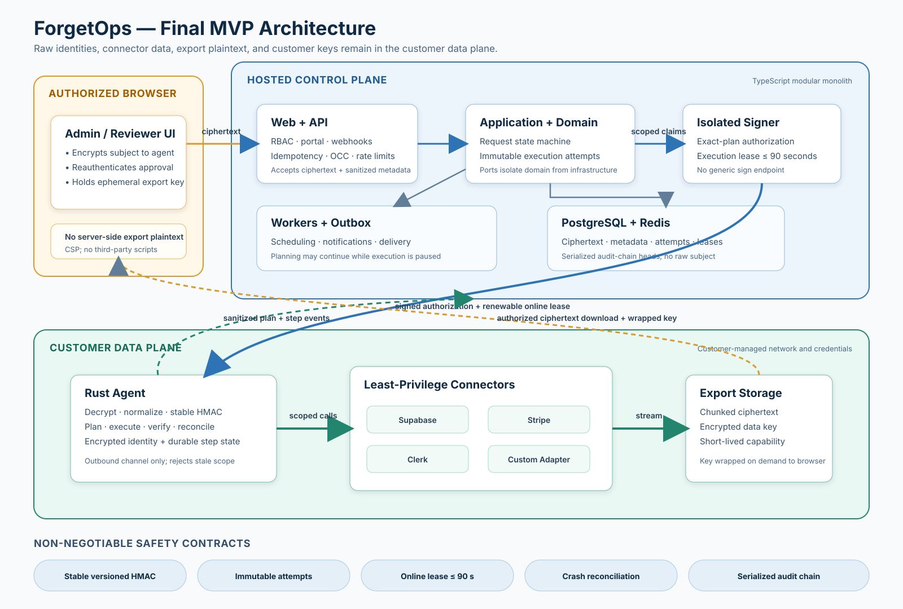

# ForgetOps

> Privacy-preserving data deletion and export orchestration for modern SaaS.

**Status: Developer Preview.** ForgetOps is under active development and is not
production-ready. It automates configured data-lifecycle policy; it does not
determine legal obligations or guarantee regulatory compliance.

ForgetOps coordinates account deletion and data export across application
databases and third-party systems. A TypeScript control plane manages lifecycle
and audit metadata, while a self-hosted Rust agent keeps raw identities,
connector credentials, and export contents in your environment.



## Why ForgetOps

Deleting or exporting an account is rarely a single database operation. Data
often spans application records, object storage, and external systems. ForgetOps
turns that work into a reviewable lifecycle: discover data, approve the exact
plan, execute configured actions, and retain audit evidence without moving raw
identities or export contents into the control plane.

## Intended workflows

### Delete account

Implemented building blocks cover deletion request state, subject-envelope
handling, plan approval, execution authorization, and audit metadata. When the
control plane and agent execution loop are wired into a deployment, the intended
workflow is to discover matching data, review a sanitized plan, then execute
configured erase, anonymize, or retention actions with verification.

### Export my data

Implemented building blocks cover export requests, encrypted archive creation,
browser-key wrapping, and download capabilities. When the remaining deployment
wiring is complete, the intended workflow is for the agent to discover and
gather data locally, publish an encrypted archive to customer-owned storage,
and let a reauthenticated browser obtain the archive key for download.

## Implemented in this preview

- Tenant, project, and environment isolation with PostgreSQL-backed lifecycle
  and audit metadata.
- Delete and export request state machines, subject-envelope handling,
  idempotency, approvals, and privacy-portal status/download capabilities.
- Signed agent pairing and messages, short-lived execution leases, pause
  enforcement, and encrypted local agent state.
- Chunked encrypted export archives with manifests and reauthentication-bound
  browser-key wrapping.
- A Supabase connector for configured discovery, export, erase/anonymize, and
  verification flows, plus a TypeScript connector SDK.

## Known limits

- Supabase is the only implemented connector. Stripe and Clerk remain design
  targets, not shipped integrations.
- The agent execution loop, agent healthcheck, and persistent archive-storage
  adapter are not yet wired into a runnable end-to-end deployment.
- The production-pilot validation is incomplete: scale, operational runbook,
  incident-recovery, and signed-release gates still need evidence.
- Connector behavior depends on your configuration and each provider's APIs;
  review plans and results before acting on real data.

## Safety model

The control plane stores sanitized lifecycle and audit metadata. Raw subject
identities, connector credentials, export contents, and archive keys remain in
the customer environment managed by the self-hosted agent. Destructive work is
planned before execution and is bounded by approvals, authorization, and
short-lived leases. These controls reduce operational risk; they do not replace
your legal, security, or retention decisions.

## Development quickstart

Prerequisites: Node.js 22, pnpm 11.16.0, Rust 1.97.1, and Docker for
container-backed integration tests.

```bash
git clone https://github.com/plantrungnampl/ForgetOps.git
cd ForgetOps
corepack enable
pnpm install --frozen-lockfile
pnpm build
cargo test --workspace
```

Run `pnpm test` with Docker available to include PostgreSQL/Testcontainers
integration coverage.

## Monorepo map

- `apps/` — API, web, worker, and signer composition roots.
- `packages/` — domain, application, contracts, database, observability, and
  test support.
- `agent/` — self-hosted Rust agent, connector SDK, Supabase connector, and
  export builder.
- `sdk/typescript/` — TypeScript custom connector adapter SDK.
- `deploy/` — Docker Compose examples for the control plane and agent.
- `docs/ForgetOps-Design-Package/` — architecture, safety invariants, and
  implementation-readiness contracts.

## Near-term roadmap

- Complete production-pilot safety and operational validation.
- Add and validate more first-party connectors.
- Improve deployment guidance and end-to-end developer onboarding.

## Community

Read [CONTRIBUTING.md](CONTRIBUTING.md) before opening a pull request. Report
security vulnerabilities privately through [SECURITY.md](SECURITY.md). This
project is licensed under the [Apache License 2.0](LICENSE).
