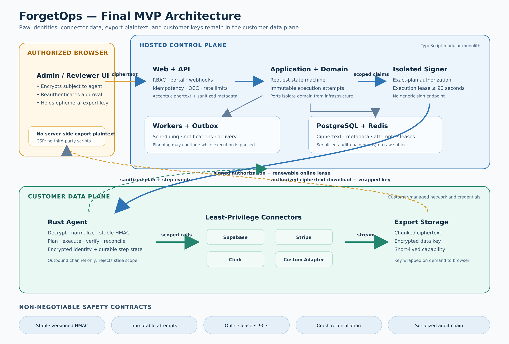

# ForgetOps System Design

**Date:** 2026-07-23
**Status:** Implementation-ready design baseline
**Audience:** Product, security, platform, and implementation reviewers
**Delivery model:** Hosted TypeScript control plane + isolated signer + customer-hosted Rust agent



## Executive summary

ForgetOps automates two data-lifecycle workflows for small AI SaaS teams: **Delete account** and **Export my data**. The hosted control plane manages tenant configuration, request state, approvals, notifications, billing, and sanitized audit metadata. A Rust agent runs in the customer's environment and keeps raw subject identifiers, connector credentials, discovery results, destructive execution details, export plaintext, and customer encryption keys in the customer data plane.

The implementation baseline is a modular monolith with explicit Clean Architecture dependency rules, PostgreSQL as the source of truth, Redis-backed workers, an isolated signer, signed exact-plan authorizations, and short-lived online execution leases. Destructive work is modeled as immutable attempts with durable step intents and post-crash reconciliation. Export generation is bounded and streaming; the data key is wrapped on demand to a reauthenticated browser key.

The central security guarantee is deliberately narrow: disclosure of the hosted operational database does not reveal raw subject identifiers or export plaintext and does not enable offline guessing of low-entropy identifiers. Authorization also depends on user authentication, approval evidence, agent-local policy, and an online lease. A full compromise of the hosted application or served frontend remains a separate, documented residual risk.

## How to read this specification

The architecture chapters are authoritative together. Chapter 11 collects the cross-cutting contracts that implementation and review gates must enforce. If examples in an earlier chapter are ambiguous, Chapter 11 and the more restrictive security interpretation take precedence.

## Contents

- [Executive summary](#executive-summary)
- [Product Scope](#product-scope)
- [System Architecture](#system-architecture)
- [Domain and Data Model](#domain-and-data-model)
- [Agent-Control Plane Protocol](#agent-control-plane-protocol)
- [Connectors and TypeScript Adapter SDK](#connectors-and-typescript-adapter-sdk)
- [Security, Privacy, and Threat Model](#security-privacy-and-threat-model)
- [API, Events, and Error Contracts](#api-events-and-error-contracts)
- [Deployment, Observability, and Operations](#deployment-observability-and-operations)
- [Testing and Release Quality](#testing-and-release-quality)
- [Roadmap and Architecture Decisions](#roadmap-and-architecture-decisions)
- [Implementation Readiness Contracts](#implementation-readiness-contracts)
- [Final design acceptance criteria](#final-design-acceptance-criteria)

## Design principles

1. **Keep customer data in the customer trust boundary.** Hosted services receive ciphertext and sanitized operational metadata, not connector records or export plaintext.
2. **Bind destructive execution to current evidence.** Approval, plan, policy, connector configuration, attempt, and step scope are cryptographically bound.
3. **Require current online permission.** A signed execution lease valid for at most 90 seconds limits pause, cancellation, and revocation delay between destructive steps.
4. **Persist intent before effects.** Crash recovery reconciles uncertain connector outcomes before any retry.
5. **Make partial failure and retry explicit.** Each retry is a new immutable attempt; exactly-once remote calls are not promised.
6. **Keep the architecture operable by a small team.** Complexity is concentrated at trust boundaries and destructive-effect boundaries.
7. **Treat legal policy as customer input.** ForgetOps executes configured policy and does not determine legal obligations.

---

# Product Scope

## 1. Product statement

ForgetOps is a data lifecycle runtime for small AI SaaS teams. It gives developers one controlled workflow to discover, export, erase, anonymize, retain, and verify a user's data across application databases and third-party services.

The MVP is not a broad privacy-compliance suite. It focuses on two high-risk engineering jobs:

- A user asks for a copy of their data.
- A user asks for account and data deletion.

## 2. Primary user

The primary customer is a technical founder or small engineering team operating an AI SaaS with a stack similar to:

- Supabase for PostgreSQL, storage, and authentication-adjacent data
- Clerk for user identity
- Stripe for billing records
- A vector database, custom service, or internal database accessed through the custom adapter SDK

The team does not have a dedicated privacy engineering or compliance operations function.

## 3. User roles

### Owner

- Creates the tenant
- Manages billing
- Adds or removes members
- Creates projects and environments
- Pairs or revokes agents
- Changes destructive-operation policy

### Admin

- Configures connectors
- Creates administrative requests
- Reviews request details
- Manages privacy portal configuration
- Retries failed steps

### Reviewer

- Reviews dry-run plans
- Approves or rejects destructive operations
- Accepts justified retention outcomes
- Downloads audit reports

## 4. Core user journeys

### 4.1 Administrative deletion request

1. Admin selects project and production environment.
2. Admin submits a subject identifier in the browser.
3. Browser encrypts the identifier to the environment agent's public key.
4. Control plane creates a request containing only ciphertext and operational metadata.
5. Agent decrypts, normalizes the subject, computes the keyed subject hash, and discovers data.
6. Control plane binds the subject transactionally, cancelling or explicitly overriding a duplicate active request.
7. Agent returns a sanitized plan with counts, actions, risks, policy version, and connector-configuration fingerprint.
8. Reviewer reauthenticates and approves the exact plan version.
9. Isolated signer validates approval evidence and signs an execution authorization.
10. Agent obtains a short-lived online lease before scheduling destructive steps.
11. Agent executes independent steps, reconciles uncertain outcomes, and verifies final state.
12. Control plane shows completion, retained items, and unresolved steps.

### 4.2 End-user deletion request

1. User opens the project's privacy portal.
2. User authenticates through a short-lived assertion produced after Clerk reauthentication.
3. If reauthentication is unavailable, the customer identity adapter performs a magic-link challenge.
4. Control plane creates a verified privacy request without retaining raw identity data.
5. The remaining flow is the same as the administrative request.

### 4.3 Data export request

1. Verified request enters planning.
2. Agent discovers exportable records and generates a sanitized plan.
3. After approval or policy-based auto-authorization, connectors collect data locally.
4. Agent creates a structured archive and manifest.
5. Agent encrypts the archive as a chunked stream and uploads it to customer-owned object storage.
6. Agent retains the archive key only as encrypted local state until archive expiry.
7. After recent identity verification, the browser generates an ephemeral key and requests an on-demand download capability.
8. Agent wraps the archive key to that browser key and returns only a sealed key envelope and short-lived link metadata.
9. Browser streams download and decryption.
10. Link, encrypted local key material, and archive expire according to project policy.

## 5. Functional requirements

### Request management

- Create delete and export requests from dashboard, API, or privacy portal.
- Support idempotency keys and expected aggregate versions on every state-changing operation.
- Enforce one active destructive request per subject and environment unless explicitly overridden by an owner.
- Allow cancellation before execution authorization.
- Prevent cancellation after an irreversible step has started; use compensating status instead.
- Model every initial execution and retry as an immutable execution attempt.

### Identity handling

- Never store raw email, user ID, or external identifiers in control-plane business tables.
- Store a keyed HMAC subject hash for correlation within one environment.
- Store the subject-HMAC key version and canonicalization version with every binding.
- Keep the environment subject-HMAC key stable across agent replacement.
- Encrypt the raw subject to the agent public key before persistence or transit through the control plane.
- Delete subject ciphertext after the agent binds the request or after a maximum 24-hour TTL.
- Block normal agent replacement while unconsumed envelopes or active execution attempts exist.

### Planning

- Every delete workflow runs discovery before execution.
- Plans include connector, resource type, action, estimated count, risk, dependency summary, and retention reason category.
- Plan approval binds to request ID, environment ID, plan ID, plan version, and expiry.
- Any material re-plan invalidates previous approval.
- Connector-configuration, policy, or local-plan fingerprint changes invalidate authorization.

### Execution

- Independent connectors continue when another connector fails.
- Each step is idempotent and independently retryable.
- Agent verifies the result of destructive actions.
- A request completes only when all steps are succeeded, skipped by policy, or accepted as retained/needs-review.
- Control plane never sends an unsigned delete command.
- Production destructive steps require an unexpired online execution lease with a maximum 90-second TTL.
- Offline agents may reconcile and report work but may not schedule another destructive step.
- ForgetOps guarantees an idempotent final state, not exactly one remote API call.

### Export

- Export data never enters the server-side hosted control plane; ciphertext is stored in customer storage and plaintext is handled only by the agent and authorized browser.
- Archive contains a machine-readable manifest and human-readable index.
- Archive is encrypted as a versioned, chunked authenticated stream before upload.
- Storage is customer-owned and private.
- Access link expires and can be revoked.
- Archive keys can be rewrapped after recent user reauthentication without rebuilding the archive.

### Audit

- Every state transition emits an append-only audit event.
- Audit events form a tamper-evident hash chain per environment.
- Audit chain insertion is serialized per environment in the same transaction as state and outbox changes.
- Audit metadata excludes raw PII and record contents.
- Reports show action, actor, timestamps, plan version, connector outcomes, counts, and retention categories.

## 6. Non-functional requirements

### Availability

- Control plane target: 99.5% monthly availability for the MVP.
- Agent tolerates control-plane disconnects and resumes through polling.
- Offline agents may finish a remote call that already started, but they do not schedule another destructive step without a fresh online lease.

### Performance

- Dashboard reads: p95 below 500 ms under normal MVP load.
- Agent heartbeat interval: 30 seconds while connected.
- Job delivery: under 10 seconds through WebSocket, under 60 seconds through polling fallback.
- Planning and execution durations depend on connector APIs and are reported independently.

### Scale

- 100 tenants
- Up to 5 projects per tenant
- Staging and production per project
- About 1,000 privacy requests per month
- One active agent per environment in the MVP
- Capacity test ceiling: 1,000 simultaneously connected agents

### Security

- TLS for all remote transport.
- Ed25519 signatures for agent and control-plane commands.
- Encryption at rest for sensitive local agent state.
- Least-privilege connector credentials.
- No control-plane access to customer records or export content.
- Strict CSP and no third-party JavaScript on identity-entry, approval, and export-decryption pages.
- Database-disclosure and full-application-compromise guarantees are stated separately.

## 7. Non-goals

The MVP does not include:

- Automatic legal interpretation by country
- A universal data catalog
- Data loss prevention or real-time content inspection
- Enterprise custom RBAC
- Kubernetes deployment
- Multi-region control plane
- Customer-managed control-plane encryption keys
- Automatic deletion from immutable backups
- Full workflow rollback after deletion
- Exactly-once remote API invocation
- Guaranteed interruption of a remote call that has already started
- Support for every vector database
- A guarantee of regulatory compliance

## 8. Success metrics

### Activation

- Tenant pairs a production agent and completes a dry-run within 30 minutes.
- At least three connectors are healthy.

### Reliability

- More than 95% of connector steps complete without manual intervention after initial configuration.
- Zero unauthorized destructive executions.
- Zero raw-PII control-plane log incidents.

### Product value

- Median manual engineering time per request is reduced by at least 80% in pilot customers.
- At least 50% of activated tenants complete a second request within 60 days or enable automatic account-closure cleanup.

## 9. Product boundary statement

ForgetOps decides **how to execute configured data handling policy**, not **what the law requires**. A project administrator owns retention rules and connector scope. The product must preserve this distinction in UI copy, documentation, and contracts.

---

# System Architecture

## 1. Architecture choice

The MVP uses a **modular monolith control plane** and a **separate self-hosted data-plane agent**.

This choice minimizes operational burden for a solo developer while preserving clear boundaries that can be extracted later. Microservices and a full event bus are intentionally deferred.

## 2. Trust boundaries

```text
Hosted Server Side                    Customer Infrastructure
--------------------------------      --------------------------------
Tenant/project configuration          Raw subject identity
Request lifecycle                     Environment subject-HMAC key
Plan projection                       Supabase/Stripe/Clerk credentials
Approval metadata                     Connector responses
Step counts and status                Record IDs and contents
Audit metadata                        Full execution graph
Billing and notifications             Export archive and encryption keys
                                      Temporary workspace
```

Administrative and end-user browsers form a separate boundary. They temporarily handle plaintext before subject encryption or after export decryption. The server-side control plane is not trusted with customer application data. The agent is trusted to execute authorized policy within one environment, subject to local policy and online destructive leases.

## 3. Control-plane components

### Web application

Responsibilities:

- Owner/admin/reviewer dashboard
- Privacy portal
- Request review and approval
- Agent and connector status
- Audit report rendering
- Billing and tenant settings

Recommended implementation: Next.js with server-side rendering for authenticated pages and a small client surface for live request progress.

### API application

Responsibilities:

- REST endpoints
- WebSocket agent gateway
- Authentication and authorization
- State-machine commands
- Agent pairing and key rotation
- Signed execution authorization
- Short-lived execution leases
- Webhooks for customer applications

Recommended implementation: Fastify with Zod-based validation and OpenAPI generation.

### Isolated authorization signer

Responsibilities:

- Verify current request and aggregate version
- Verify plan, policy, connector fingerprint, and allowed step scope
- Verify recent reviewer reauthentication and approval evidence
- Enforce separation of duty, authorization TTL, and global pause
- Sign execution authorization and lease claims through a narrow interface

The signing key is isolated from ordinary application secrets. The signer does not expose a generic `sign(bytes)` API.

### Background worker

Responsibilities:

- Notification delivery
- Request deadline reminders
- Agent offline detection
- Expired authorization cleanup
- Outbox event processing
- Billing usage aggregation

Recommended implementation: BullMQ backed by Redis.

### PostgreSQL

Source of truth for:

- Tenants and memberships
- Projects and environments
- Agent public identities
- Environment subject-key versions
- Connector metadata
- Privacy request lifecycle
- Sanitized plans and step projections
- Approvals
- Audit chain
- Job and outbox state
- Idempotency records and serialized audit-chain heads

### Redis

Used for:

- Background queues
- Short-lived rate limits
- WebSocket presence
- Idempotency response cache

Redis is not the source of truth for request state.

## 4. Agent components

### Connection manager

- Maintains outbound WebSocket connection.
- Falls back to authenticated HTTPS polling.
- Handles reconnect, jitter, and server backoff instructions.
- Never opens an inbound public port.

### Command verifier

- Verifies control-plane signatures.
- Checks environment, request, plan version, expiry, and nonce.
- Rejects replayed or stale execution authorization.
- Requires a fresh online execution lease before scheduling a destructive step.

### Workflow engine

- Converts a sanitized plan plus local discovery results into an execution DAG.
- Persists local step state.
- Leases runnable steps.
- Applies retry and backoff.
- Supports cancellation before irreversible execution begins.
- Reconciles uncertain `in_flight` steps through verification before retry.

### Connector runtime

- Loads official connector configuration.
- Calls Supabase, Stripe, and Clerk APIs.
- Calls custom TypeScript adapter through private HTTP.
- Enforces connector capabilities and credential scopes.

### Local state store

SQLite database containing:

- Encrypted local subject identity after envelope decryption
- Full discovery output
- Execution graph
- Step attempt history
- Export artifact manifest
- Local audit details

Sensitive columns are encrypted using XChaCha20-Poly1305 with a master key supplied through a Docker secret. Generated agent identity keys are encrypted in the state volume; the Compose secret itself remains read-only. The environment subject-HMAC key is a separately provisioned, versioned secret that survives agent replacement.

### Export builder

- Normalizes connector output into a documented archive layout.
- Produces `manifest.json` and `index.html`.
- Creates an archive.
- Encrypts archive content.
- Uploads to customer-owned object storage.
- Returns only sanitized metadata and capability references.

## 5. Data flow: delete request

```text
Admin/User
  -> browser encrypts subject to agent public key
  -> Control Plane creates request
  -> Agent receives planning job
  -> Agent decrypts and computes subject HMAC
  -> Connectors discover matching resources
  -> Agent creates local DAG and sanitized plan
  -> Control Plane stores plan projection
  -> Reviewer approves exact plan version
  -> Control Plane signs execution authorization
  -> Agent verifies authorization
  -> Agent obtains short-lived online execution lease
  -> Agent persists step intent
  -> Agent executes independent steps
  -> Agent verifies uncertain and completed outcomes
  -> Agent verifies each connector outcome
  -> Agent sends sanitized progress events
  -> Control Plane closes request or marks partial failure
```

## 6. Data flow: export request

```text
Verified request
  -> discovery and plan
  -> authorization
  -> connector exports to local workspace
  -> archive builder normalizes data as a bounded stream
  -> chunked archive encrypted with random data key
  -> archive uploaded to customer object storage
  -> data key retained only as encrypted agent state
  -> verified browser creates ephemeral public key
  -> agent wraps data key on demand to that browser session
  -> control plane returns sealed key envelope and expiring link metadata
  -> verified browser streams download and decryption
  -> archive and link expire
```

## 7. Control-plane module boundaries

```text
modules/
  identity-access/
  tenants-projects/
  agent-management/
  connector-registry/
  privacy-requests/
  identity-verification/
  execution-plans/
  approvals/
  audit/
  notifications/
  billing/
```

Rules:

- Each module owns its domain model, application use cases, and repository interfaces.
- Cross-module communication uses application services or internal domain events.
- No module imports another module's database repository.
- Public module APIs use shared domain contracts, not ORM models.
- State transitions occur through command methods, not direct status updates.
- Transport schemas map to application request models; domain code does not import Zod or framework types.
- Concrete repositories and external gateways are wired only in composition roots.

## 8. Suggested repository structure

```text
forgetops/
  apps/
    web/                  # Next.js dashboard and privacy portal
    api/                  # Fastify REST and agent gateway
    worker/               # BullMQ jobs
  packages/
    contracts/            # Zod schemas and generated JSON Schema
    domain/               # State machines, value objects, policies
    application/          # Use cases and repository/gateway ports
    database/             # Drizzle adapters, schema, and migrations
    auth/                 # Clerk-backed admin authentication and RBAC
    observability/        # Logging, metrics, tracing helpers
    testing/              # Fixtures and Testcontainers helpers
  agent/
    crates/
      agent-core/
      agent-protocol/
      agent-store/
      connector-sdk/
      connector-supabase/
      connector-stripe/
      connector-clerk/
      adapter-http/
      export-builder/
    bin/forgetops-agent/
  sdk/
    typescript/
  deploy/
    control-plane/
    agent-compose/
  docs/
```

CI enforces this dependency direction:

```text
domain <- application <- contracts/interface adapters <- applications/frameworks
```

## 9. Deployment topology

### Hosted

- Web application
- API application
- Worker process
- Managed PostgreSQL
- Managed Redis
- S3-compatible metadata storage, excluding export payloads
- Isolated authorization signer or signing boundary

The applications may run from one container image with separate commands. This preserves a modular monolith while allowing web, API, and worker processes to scale independently.

### Customer environment

```text
Docker Compose
  forgetops-agent
  customer-app or custom-adapter
  encrypted state volume
  Docker secrets for master key, environment subject key, and connector credentials
  outbound Internet access
```

## 10. Evolution path

Extract a service only when one of these conditions is met:

- Independent scaling is repeatedly required.
- A module needs a different availability or security boundary.
- Deployment coupling causes measurable release risk.
- A separate team owns the module.

Likely first extractions:

1. Agent gateway
2. Notification worker
3. Audit/report service

The privacy-request state machine remains the source of truth until there is a proven reason to split it.

---

# Domain and Data Model

## 1. Aggregate overview

```text
Tenant
  Project
    Environment
      Agent
      Connector
      Policy
      PrivacyRequest
        ExecutionPlan
        ExecutionAttempt
        ExecutionStepProjection
        Approval
        AuditEvent
```

`PrivacyRequest` is the primary business aggregate. The agent owns the detailed execution graph; the control plane stores a sanitized projection.

## 2. Tenant and membership

```ts
export type Role = "owner" | "admin" | "reviewer";

export interface Tenant {
  id: string;
  name: string;
  plan: "trial" | "starter" | "team";
  createdAt: string;
}

export interface Membership {
  tenantId: string;
  userId: string;
  role: Role;
  createdAt: string;
}
```

Authorization rules:

- Every tenant has at least one owner.
- Only owners manage billing and destructive-operation defaults.
- Owners and admins create requests.
- Owners, admins, and reviewers can approve when separation-of-duty policy allows it.
- The request creator cannot approve their own destructive request when two-person approval is enabled.

## 3. Project and environment

```ts
export interface Project {
  id: string;
  tenantId: string;
  name: string;
  slug: string;
  createdAt: string;
}

export interface Environment {
  id: string;
  projectId: string;
  kind: "staging" | "production";
  status: "active" | "disabled";
  subjectHashKeyVersion: number;
  subjectCanonicalizationVersion: number;
  createdAt: string;
}
```

Constraints:

- Maximum five projects per tenant in the MVP.
- Exactly one staging and one production environment per project.
- Credentials, agents, subject hashes, and requests are environment-scoped.
- Data cannot be moved between staging and production.

## 4. Agent

```ts
export interface Agent {
  id: string;
  environmentId: string;
  publicSigningKey: string;
  publicEncryptionKey: string;
  version: string;
  protocolVersion: string;
  status: "pairing" | "online" | "offline" | "outdated" | "revoked";
  lastSeenAt: string | null;
  lastSequence: string;
  createdAt: string;
}
```

Only one active agent is allowed per environment in the MVP. Pairing a replacement revokes the previous agent after explicit owner confirmation. The environment subject-HMAC key is not part of the replaceable agent identity and remains stable across ordinary replacement.

## 5. Connector metadata

```ts
export type ConnectorCapability =
  | "discover"
  | "export"
  | "delete"
  | "anonymize"
  | "retain"
  | "verify";

export interface ConnectorMetadata {
  id: string;
  environmentId: string;
  type: "supabase" | "stripe" | "clerk" | "custom";
  displayName: string;
  capabilities: ConnectorCapability[];
  status: "connected" | "degraded" | "disabled";
  configurationFingerprint: string;
  lastHealthCheckAt: string | null;
}
```

The control plane stores no connector secret or endpoint credential.

## 6. Privacy request

```ts
export type PrivacyRequestType = "delete" | "export";
export type PrivacyRequestSource = "admin" | "privacy_portal" | "api";

export type PrivacyRequestStatus =
  | "created"
  | "identity_verification_pending"
  | "identity_verified"
  | "planning"
  | "awaiting_approval"
  | "execution_authorized"
  | "executing"
  | "needs_review"
  | "completed"
  | "partially_completed"
  | "failed"
  | "cancelled";

export interface PrivacyRequest {
  id: string;
  environmentId: string;
  type: PrivacyRequestType;
  source: PrivacyRequestSource;
  subjectHash: string | null;
  subjectHashKeyVersion: number | null;
  subjectCanonicalizationVersion: number | null;
  duplicateOverride: boolean;
  duplicateOfRequestId: string | null;
  currentAttemptId: string | null;
  status: PrivacyRequestStatus;
  policyVersion: number;
  deadlineAt: string;
  createdByActorId: string;
  createdAt: string;
  completedAt: string | null;
  version: number;
}
```

The `version` field implements optimistic concurrency control.

## 7. State machine

### Allowed transitions

```text
created -> identity_verification_pending
created -> identity_verified                 # trusted administrative API
created -> cancelled
identity_verification_pending -> identity_verified
identity_verification_pending -> failed
identity_verification_pending -> cancelled
identity_verified -> planning
identity_verified -> cancelled
planning -> awaiting_approval
planning -> execution_authorized             # approved auto-execution policy
planning -> failed
planning -> cancelled
awaiting_approval -> execution_authorized
awaiting_approval -> planning                 # re-plan or changes requested
awaiting_approval -> cancelled
execution_authorized -> executing
execution_authorized -> awaiting_approval     # expired or invalidated authorization
execution_authorized -> cancelled             # authorization not consumed
executing -> completed
executing -> partially_completed
executing -> failed
executing -> needs_review
partially_completed -> planning
partially_completed -> execution_authorized  # selected-step retry attempt
partially_completed -> needs_review
partially_completed -> completed             # accepted retained outcome
failed -> planning
failed -> execution_authorized               # selected-step retry attempt
failed -> needs_review
failed -> cancelled
needs_review -> planning
needs_review -> execution_authorized
needs_review -> partially_completed
needs_review -> completed
needs_review -> cancelled
```

Only `completed` and `cancelled` are permanently terminal. Forbidden transitions are rejected at the domain layer and recorded as security events.

## 8. Subject identity

Raw subject identifiers exist only in encrypted envelopes and local agent state.

```ts
export interface SubjectEnvelope {
  requestId: string;
  environmentId: string;
  ciphertext: string;
  encryptionKeyId: string;
  expiresAt: string;
  consumedAt: string | null;
}
```

The agent normalizes identifiers and returns a versioned binding:

```ts
export interface SubjectBinding {
  requestId: string;
  environmentId: string;
  subjectHash: string;
  subjectHashKeyVersion: number;
  canonicalizationVersion: number;
  duplicateOfRequestId: string | null;
}
```

```text
subjectHash = HMAC-SHA-256(environmentSubjectKeyVersion, canonicalIdentity)
```

The environment subject key remains in the customer data plane. The control plane cannot perform an offline dictionary attack against email hashes. Subject binding is serialized per environment, subject hash, and request type so concurrent duplicate intake resolves deterministically.

## 9. Execution plan

```ts
export interface ExecutionPlan {
  id: string;
  requestId: string;
  version: number;
  fingerprint: string;
  status: "draft" | "approved" | "rejected" | "expired";
  totalSteps: number;
  estimatedRecords: number;
  requiresApproval: boolean;
  generatedAt: string;
  expiresAt: string;
}
```

A plan fingerprint covers the canonical sanitized plan. Approval is invalid if the fingerprint or version changes.

The canonical plan includes policy version and connector-configuration fingerprint.

## 10. Execution attempt

```ts
export interface ExecutionAttempt {
  id: string;
  requestId: string;
  attemptNumber: number;
  kind: "initial" | "retry";
  planId: string;
  planVersion: number;
  planFingerprint: string;
  allowedStepIds: string[];
  status:
    | "planned"
    | "awaiting_approval"
    | "authorized"
    | "running"
    | "succeeded"
    | "partially_succeeded"
    | "failed"
    | "needs_review"
    | "cancelled";
  createdAt: string;
  completedAt: string | null;
}
```

A selective retry creates a new immutable attempt with a new authorization and nonce.

## 11. Step projection

```ts
export type StepStatus =
  | "pending"
  | "running"
  | "succeeded"
  | "failed"
  | "needs_review"
  | "blocked"
  | "skipped";

export interface ExecutionStepProjection {
  id: string;
  requestId: string;
  attemptId: string;
  planVersion: number;
  connectorType: string;
  resourceType: string;
  action: "export" | "delete" | "anonymize" | "retain" | "verify";
  risk: "low" | "medium" | "high";
  status: StepStatus;
  estimatedCount: number | null;
  affectedCount: number | null;
  errorCategory: string | null;
  startedAt: string | null;
  completedAt: string | null;
}
```

Record IDs, queries, and contents are excluded.

## 12. Approval and authorization

```ts
export interface Approval {
  id: string;
  requestId: string;
  planId: string;
  planVersion: number;
  planFingerprint: string;
  decision: "approved" | "rejected";
  decidedBy: string;
  authenticationMethod: "session_reauth" | "webauthn";
  evidenceHash: string;
  comment: string | null;
  createdAt: string;
}
```

Execution authorization is a signed immutable document:

```ts
export interface ExecutionAuthorizationClaims {
  type: "forgetops.execution-authorization";
  version: 1;
  keyId: string;
  issuer: "forgetops-control-plane";
  audience: "forgetops-agent";
  environmentId: string;
  agentId: string;
  requestId: string;
  attemptId: string;
  authorizationKind: "initial" | "retry";
  planId: string;
  planVersion: number;
  planFingerprint: string;
  policyVersion: number;
  connectorConfigurationFingerprint: string;
  allowedStepIds: string[];
  approvalEvidenceHash: string;
  issuedAt: string;
  notBefore: string;
  expiresAt: string;
  nonce: string;
}
```

Execution authorization permits an attempt but does not by itself allow offline destructive scheduling. A short-lived signed execution lease, valid for at most 90 seconds, is also required.

## 13. Audit event

```ts
export interface AuditEvent {
  id: string;
  tenantId: string;
  environmentId: string;
  requestId: string | null;
  actorType: "user" | "agent" | "system";
  actorId: string;
  action: string;
  metadata: Record<string, string | number | boolean | null>;
  sequence: string;
  previousEventHash: string | null;
  eventHash: string;
  createdAt: string;
}
```

Hash calculation:

```text
eventHash = SHA-256(
  UTF8("forgetops.audit-event.v1") ||
  0x00 ||
  previousEventHashBytes ||
  JCS(eventWithoutHashes)
)
```

The application serializes events using RFC 8785 JSON Canonicalization Scheme before hashing. The environment chain-head row is locked while allocating `sequence`, inserting the event, updating the head, and inserting the outbox event.

## 14. Core database tables

```text
tenants
memberships
projects
environments
agents
agent_pairing_tokens
connectors
policies
privacy_requests
subject_envelopes
subject_bindings
execution_plans
execution_attempts
execution_step_projections
approvals
execution_authorizations
execution_leases
agent_jobs
job_leases
idempotency_records
outbox_events
audit_events
audit_chain_heads
notifications
billing_accounts
usage_records
```

## 15. Database integrity rules

- Unique membership on `(tenant_id, user_id)`.
- Unique environment on `(project_id, kind)`.
- Unique active agent on `environment_id` through a partial index.
- Unique idempotency key on `(tenant_id, scope, actor_id, idempotency_key)`.
- Unique ordinary active request on `(environment_id, subject_hash, type)` where status is not permanently terminal and `duplicate_override = false`.
- Unique execution attempt on `(request_id, attempt_number)`.
- Unique audit sequence on `(environment_id, sequence)`.
- Approval must reference the current plan version.
- Audit events cannot be updated or deleted by the application role.
- Tenant ID is copied onto high-volume tables for efficient authorization filters.

## 16. Outbox and audit pattern

Every state transition and its internal event are committed in one PostgreSQL transaction:

```text
BEGIN
  select audit_chain_heads for update
  update privacy_requests
  insert audit_events
  update audit_chain_heads
  insert outbox_events
COMMIT
```

The worker publishes the outbox event to Redis-backed jobs. Delivery is at least once; consumers must be idempotent.

---

# Agent-Control Plane Protocol

## 1. Goals

The protocol must:

- Keep all connections outbound from the customer network.
- Authenticate both control plane and agent.
- Prevent replay and cross-environment commands.
- Support near-real-time WebSocket delivery and polling fallback.
- Tolerate duplicate delivery.
- Avoid transmitting raw PII in progress events.
- Preserve safe execution after disconnect and restart.

## 2. Protocol versions

Every message includes:

```json
{
  "type": "forgetops.agent-message",
  "protocolVersion": "1.0",
  "messageType": "job.available",
  "messageId": "msg_01...",
  "keyId": "cp-signing-2026-07",
  "environmentId": "env_01...",
  "agentId": "agt_01...",
  "direction": "control_to_agent",
  "sequence": "1042",
  "sentAt": "2026-07-21T10:00:00Z",
  "payload": {},
  "signature": "base64url(...)"
}
```

Unknown major versions are rejected. Unknown minor fields are ignored.

## 3. Pairing

### Control-plane preparation

1. Owner creates an environment.
2. Control plane generates a one-time pairing token valid for 15 minutes.
3. Token is shown once.

### Agent initialization

1. Agent generates:
   - Ed25519 signing key pair
   - X25519 encryption key pair
2. Customer provisions or reuses:
   - Versioned environment subject-HMAC key
   - Agent-state master encryption key
3. Generated private identity keys are encrypted under the master key and written to the persistent state volume. Docker secrets remain read-only.
4. Agent sends pairing token, public keys, key IDs, protocol version, and instance fingerprint.
5. Control plane binds the public keys to the environment.
6. Pairing token is destroyed.

### Replacement

A new agent cannot silently replace an active production agent. Owner must approve replacement. Normal replacement is blocked while unconsumed subject envelopes or active execution attempts exist. Forced replacement revokes the previous agent, marks affected requests `needs_review`, and requires identity resubmission when an old X25519 private key is unavailable.

## 4. Transport

### Primary: WebSocket

- Endpoint: `wss://api.forgetops.example/v1/agent-stream`
- Authentication: signed `agent.hello` message plus short-lived connection challenge.
- Heartbeat: every 30 seconds.
- Server closes silent connections after 90 seconds.

### Fallback: HTTPS polling

- Endpoint: `POST /v1/agent-jobs/poll`
- Long-poll timeout: 45 seconds.
- Agent uses exponential reconnect backoff with jitter, capped at 60 seconds.

## 5. Message signing

Signature input:

```text
UTF8("forgetops.agent-message.v1") ||
0x00 ||
RFC8785_JCS(unsignedMessage)
```

The sender signs these bytes using Ed25519. Cross-language fixtures contain the exact canonical bytes, signature, and public key. The receiver verifies:

- public key
- key ID and permitted key purpose
- environment and agent binding
- message direction
- timestamp freshness
- unsigned 64-bit monotonic sequence for that direction
- unseen message ID

Message IDs are retained in replay cache for at least 24 hours. Send and receive sequences are persisted independently. Only one delivery transport is active for an agent session; switching to polling invalidates the previous WebSocket session before polling may lease work.

## 6. Job model

```ts
export interface AgentJob {
  jobId: string;
  requestId: string;
  environmentId: string;
  kind:
    | "bind_subject"
    | "plan"
    | "execute"
    | "lease_execution"
    | "wrap_export_key"
    | "cancel"
    | "health_check";
  planVersion: number | null;
  payloadCiphertext: string | null;
  authorization: string | null;
  availableAt: string;
  expiresAt: string;
  attempt: number;
}
```

## 7. Leasing

1. Agent receives `job.available`.
2. Agent requests a lease.
3. Control plane atomically marks job leased to that agent for 60 seconds.
4. Agent sends heartbeat every 20 seconds while running.
5. Lease extends only while agent remains valid.
6. If lease expires, job becomes available again.

A job may be delivered more than once. Agent deduplicates by `jobId` and persisted execution state.

## 8. Planning flow

```text
job: bind_subject
  -> decrypt subject envelope
  -> normalize identity
  -> compute versioned environment-scoped HMAC
  -> control plane serializes subject binding and duplicate resolution
  -> return subject.bound or subject.duplicate

job: plan
  -> discover across enabled connectors
  -> build local execution graph
  -> save graph and raw discovery locally
  -> return sanitized plan projection
```

Sanitized plan response:

```json
{
  "requestId": "req_01...",
  "planVersion": 3,
  "planFingerprint": "sha256:...",
  "steps": [
    {
      "stepId": "step_01...",
      "connectorType": "supabase",
      "resourceType": "documents",
      "action": "delete",
      "estimatedCount": 17,
      "risk": "medium"
    }
  ]
}
```

## 9. Execution authorization

The isolated signer signs an authorization after validating current state, aggregate version, approval evidence or valid auto-execution policy, plan fingerprint, connector-configuration fingerprint, policy version, allowed step scope, and global pause.

Agent checks:

- Signature matches configured control-plane public key.
- Key ID, type, version, issuer, and audience are allowed.
- Environment and agent IDs match local configuration.
- Request, execution attempt, and plan exist locally.
- Plan fingerprint, version, policy version, connector fingerprint, and allowed step IDs match.
- Authorization is unexpired.
- `notBefore` and maximum TTL are valid.
- Nonce has not been consumed.
- Current policy does not require a stronger local guard.

The nonce is persisted as consumed when the local attempt becomes authorized. Restart resumes the persisted attempt; it does not consume or replay the authorization again.

## 10. Online execution lease

Authorization alone does not permit offline destructive scheduling. Before scheduling a destructive step, the agent obtains a signed execution lease bound to environment, agent, request, attempt, and allowed step IDs.

- Maximum lease TTL: 90 seconds.
- Lease is not renewed when the agent is revoked, request is cancelled, connector is disabled, policy changes, or any global/tenant/environment pause is active.
- Agent stops scheduling new destructive steps when the lease expires.
- A remote call that already started may finish and is reconciled through verification.
- Planning, reporting, and non-destructive reconciliation may continue offline.

## 11. Progress events

Allowed metadata:

- request ID
- step ID
- connector type
- resource type category
- action
- status
- affected count
- duration
- retry attempt
- normalized error category

Prohibited metadata:

- raw subject identifiers
- record IDs
- file paths containing user identifiers
- SQL or API response bodies
- exported data
- connector secrets

## 12. Retry policy

Default connector retry:

```text
Attempt 1: immediate
Attempt 2: 5 seconds + jitter
Attempt 3: 30 seconds + jitter
Attempt 4: 2 minutes + jitter
Attempt 5: 10 minutes + jitter
```

Do not retry:

- invalid credentials
- authorization mismatch
- unsupported capability
- policy violation
- deterministic validation error

Retry with server guidance:

- rate limit
- remote timeout
- temporary network failure
- service unavailable

## 13. Idempotency and crash recovery

Each operation uses:

```text
operationKey = requestId + attemptId + planVersion + stepId + actionVersion
```

Official connectors persist a `prepared` intent before every remote mutation and a completion record after verification. When a remote API lacks idempotency support, an uncertain restart verifies whether the intended final state already exists before deciding whether another call is safe. ForgetOps guarantees idempotent final state, not exactly one remote call.

## 14. Cancellation

Cancellation is advisory until acknowledged by the agent.

- Planning jobs can always be cancelled.
- Authorized jobs can be cancelled before the nonce is consumed.
- During execution, the agent stops scheduling new steps.
- Running steps finish unless connector cancellation is safe.
- Completed destructive steps are not rolled back.
- Request becomes `partially_completed` if irreversible work occurred.

## 15. Offline behavior

- Agent may finish an already-started remote call while disconnected.
- Progress events are queued locally and sent after reconnect.
- Agent cannot schedule another destructive step without a fresh online execution lease.
- Agent never infers approval from control-plane unavailability.

## 16. Protocol errors

```text
AUTH_SIGNATURE_INVALID
AUTH_AGENT_REVOKED
AUTH_ENVIRONMENT_MISMATCH
AUTH_REPLAY_DETECTED
JOB_LEASE_EXPIRED
JOB_PAYLOAD_UNREADABLE
PLAN_VERSION_MISMATCH
AUTHORIZATION_EXPIRED
AUTHORIZATION_ALREADY_CONSUMED
EXECUTION_LEASE_REQUIRED
EXECUTION_LEASE_EXPIRED
EXECUTION_GLOBALLY_PAUSED
CONNECTOR_FINGERPRINT_MISMATCH
PROTOCOL_VERSION_UNSUPPORTED
```

Security errors are not automatically retried and generate control-plane alerts.

---

# Connectors and TypeScript Adapter SDK

## 1. Connector philosophy

A connector is not a generic CRUD wrapper. It implements a small, auditable lifecycle contract for a known system.

Every connector declares capabilities and must support dry-run planning separately from execution.

## 2. Rust connector contract

```rust
#[async_trait::async_trait]
pub trait Connector: Send + Sync {
    fn descriptor(&self) -> ConnectorDescriptor;

    async fn health_check(&self) -> Result<HealthStatus, ConnectorError>;

    async fn discover(
        &self,
        subject: &SubjectIdentity,
        request: &DiscoveryRequest,
    ) -> Result<DiscoveryResult, ConnectorError>;

    async fn export(
        &self,
        subject: &SubjectIdentity,
        selection: &ExportSelection,
        sink: &mut dyn ExportSink,
    ) -> Result<ExportResult, ConnectorError>;

    async fn erase(
        &self,
        subject: &SubjectIdentity,
        plan: &ErasePlan,
        context: &ExecutionContext,
    ) -> Result<EraseResult, ConnectorError>;

    async fn verify(
        &self,
        subject: &SubjectIdentity,
        expectation: &VerificationExpectation,
    ) -> Result<VerificationResult, ConnectorError>;
}
```

## 3. Capability rules

- `discover` is mandatory.
- `verify` is mandatory for every destructive capability.
- `delete` means remote data can be deleted.
- `anonymize` means identifiable fields can be irreversibly replaced or removed.
- `retain` means the connector can document a configured retention result.
- `export` means the connector can write normalized data into the export sink.

A connector cannot advertise `delete` without `verify`.

Connector execution follows a durable `prepared -> in_flight -> verifying -> succeeded/failed/needs_review` state machine. Each destructive connector defines recovery behavior for an uncertain `in_flight` mutation.

## 4. Discovery result

Raw result remains local. The control plane receives a projection.

```rust
pub struct DiscoveryItem {
    pub local_reference: String,
    pub resource_type: String,
    pub proposed_action: ProposedAction,
    pub estimated_count: u64,
    pub risk: RiskLevel,
    pub dependencies: Vec<String>,
    pub retention_reason: Option<String>,
}
```

`local_reference` is encrypted in the agent store and never sent to the control plane.

## 5. Official connector: Supabase

Scope:

- PostgreSQL records configured through declarative table mappings
- Supabase Storage objects configured through bucket/path mapping
- Optional Auth user deletion when the project explicitly enables it

Example policy:

```yaml
connectors:
  supabase:
    tables:
      profiles:
        identity_column: user_id
        delete: true
      documents:
        identity_column: owner_id
        delete: true
      audit_events:
        identity_column: actor_user_id
        action: anonymize
        fields: [actor_user_id, actor_email]
    storage:
      user-uploads:
        prefix: "users/{user_id}/"
        delete: true
```

Safety:

- Table and column names are allowlisted at configuration time.
- Agent uses parameterized queries only.
- Production uses a dedicated least-privilege database role restricted to configured tables, columns, functions, and storage buckets.
- Discovery and execution run in transactions where practical.
- Cascades are inspected during health validation and shown as high risk.

## 6. Official connector: Stripe

Scope:

- Discover customer by configured stable mapping.
- Export customer, subscriptions, payment methods, and selected billing objects.
- Apply configured deletion/anonymization operations supported by the customer account and API.
- Mark financial objects retained when project policy requires retention.

ForgetOps does not assume all Stripe data can or should be deleted. The connector returns one of:

- deleted
- anonymized
- retained_by_policy
- unsupported
- needs_review

## 7. Official connector: Clerk

Scope:

- Discover user identity and linked external accounts.
- Export supported profile and identity data.
- Revoke sessions before destructive execution.
- Delete the identity when policy and API capability allow it.
- Verify that active sessions and user identity are absent or disabled.

Default delete dependency:

```text
revoke_sessions -> disable_application_access -> delete_downstream_data -> delete_identity
```

Clerk identity deletion is scheduled after application data deletion to preserve mapping during discovery and execution.

## 8. Custom TypeScript adapter

The adapter runs in the customer's application or a private sidecar. The Rust agent calls it over a private network.

### Package API

```ts
import {
  createForgetOpsAdapter,
  type SubjectIdentity,
  type ResourceDefinition,
} from "@forgetops/adapter";

const documents: ResourceDefinition = {
  name: "documents",
  capabilities: ["discover", "export", "delete", "verify"],

  async discover({ subject, db }) {
    const count = await db.document.count({
      where: { ownerId: subject.userId },
    });
    return { estimatedCount: count, proposedAction: "delete", risk: "medium" };
  },

  async export({ subject, db, writer }) {
    const rows = await db.document.findMany({
      where: { ownerId: subject.userId },
    });
    await writer.json("documents/documents.json", rows);
    return { exportedCount: rows.length };
  },

  async erase({ subject, db, operationKey }) {
    const result = await db.document.deleteMany({
      where: { ownerId: subject.userId },
    });
    return { operationKey, affectedCount: result.count };
  },

  async verify({ subject, db }) {
    const remaining = await db.document.count({
      where: { ownerId: subject.userId },
    });
    return { satisfied: remaining === 0, remainingCount: remaining };
  },
};

export default createForgetOpsAdapter({ resources: [documents] });
```

## 9. Adapter HTTP protocol

Private endpoints:

```text
POST /forgetops/v1/health
POST /forgetops/v1/discover
POST /forgetops/v1/export
POST /forgetops/v1/erase
POST /forgetops/v1/verify
POST /forgetops/v1/identity/send-magic-link
POST /forgetops/v1/identity/verify-magic-link
```

Requests are signed by the agent using an adapter-specific shared secret delivered through Docker secrets. The signature covers a versioned RFC 8785 canonical envelope containing method, normalized path, timestamp, nonce, content type, and body digest. The adapter rejects invalid timestamps, requests older than 60 seconds, future clock skew beyond tolerance, and reused nonces. Nonces survive process restart for the replay window.

## 10. Adapter isolation

- Endpoint is bound to a private Docker network or loopback.
- No public ingress is required.
- Adapter code should run with a dedicated least-privilege service identity. If it is embedded in a broadly privileged customer application, a compromise inherits those privileges and the declared resource allowlist is not a hard security boundary.
- Raw results return only to the local agent.
- Adapter logs must use the provided redacting logger.
- Export responses stream through bounded frames instead of returning an unbounded JSON payload.

## 11. Connector configuration lifecycle

1. Admin selects connector type in dashboard.
2. Control plane produces non-secret configuration template.
3. Customer adds secrets to Docker Compose.
4. Agent loads configuration and performs health checks.
5. Agent sends fingerprint and capability metadata.
6. Admin enables connector for staging, then production.

Configuration changes create a new fingerprint and invalidate unexecuted plans that used the previous fingerprint.

## 12. Connector error taxonomy

```text
CREDENTIAL_INVALID
PERMISSION_INSUFFICIENT
RESOURCE_MAPPING_INVALID
SUBJECT_NOT_FOUND
RATE_LIMITED
REMOTE_TIMEOUT
REMOTE_UNAVAILABLE
ACTION_UNSUPPORTED
POLICY_REQUIRES_REVIEW
VERIFICATION_FAILED
DATA_CONFLICT
ADAPTER_PROTOCOL_ERROR
```

Connector error messages sent to the control plane are sanitized. Detailed remote responses remain local.

---

# Security, Privacy, and Threat Model

## 1. Security objectives

1. A control-plane database, backup, or metadata-storage disclosure must not expose plaintext customer records, connector credentials, export contents, or archive data keys.
2. No destructive operation may run without valid policy authorization.
3. Commands and progress events must not be replayable across requests or environments.
4. One tenant must not access another tenant's metadata.
5. Logs and telemetry must not leak raw subject identifiers.
6. Destructive scheduling must stop within the execution-lease TTL after revocation, cancellation, or pause.
7. Custom adapter privileges must be stated honestly: a declared resource allowlist is enforceable only when the adapter also runs with a least-privilege service identity.

A full compromise of hosted application code, the frontend supply chain, or the isolated signing boundary is stronger than database exfiltration and is treated separately below.

## 2. Data classification

### Restricted

- Raw email, user ID, external IDs
- Connector credentials
- Record contents
- Export archive
- Archive encryption keys
- Full discovery graph

Location: customer infrastructure and, when explicitly authorized, transiently in the administrative or end-user browser. Never in server-side hosted control-plane persistence or telemetry.

### Confidential metadata

- Subject HMAC
- Request status
- Connector names and resource categories
- Counts and normalized error categories
- Approval identities
- Audit events

Location: control plane with tenant isolation.

### Operational

- Agent version
- Heartbeats
- Latency and retry metrics
- Protocol version

## 3. Threat actors

- Internet attacker targeting the hosted control plane
- Attacker with a stolen admin session
- Malicious or compromised customer employee
- Compromised agent host
- Malicious hosted frontend or browser supply-chain dependency
- Compromised authorization signer
- Compromised custom adapter
- Supply-chain compromise in an agent or npm dependency
- Accidental operator error
- Cross-tenant application bug

## 4. Trust boundaries

```text
Browser <-> Hosted control plane
API/application services <-> isolated authorization signer
Hosted control plane <-> Customer agent
Customer agent <-> Official SaaS APIs
Customer agent <-> Custom adapter
Customer agent <-> Customer object storage
Worker <-> customer webhook destinations
```

Every boundary authenticates independently.

## 5. Threats and mitigations

### Control-plane database exfiltration

Risk: attacker obtains request metadata and subject hashes.

Mitigations:

- Subject hashes use customer-held keyed HMAC secrets.
- Raw subject envelope is encrypted to agent and deleted after binding.
- No connector secrets or export data are stored.
- Database encryption and strict production access are still required.

### Full hosted application or frontend compromise

Risk:

- Malicious browser code reads a subject before encryption or an export after decryption.
- Compromised API code attempts to submit fabricated approval state to the signer.

Mitigations:

- Do not claim that browser-side encryption protects against malicious JavaScript delivered by the same hosted origin.
- Use strict CSP, Trusted Types where supported, no third-party JavaScript on sensitive pages, reproducible builds, dependency review, and short browser sessions.
- Isolate authorization signing from the API and expose only a typed `authorizeAttempt` interface, never generic byte signing.
- Signer independently validates current plan, expected version, connector fingerprint, policy, approval evidence, separation of duty, maximum TTL, and pause state.
- Production reviewers reauthenticate before approval; high-risk deployments may require WebAuthn approval evidence.
- Customer co-signing or a self-hosted control plane is required when a fully malicious hosted control plane is in scope.

Residual risk: an attacker controlling both the hosted application and signer can authorize destructive work until detected. Short online leases, local policy, and audit alerts bound the operational window but do not create a zero-trust control plane.

### Stolen pairing token

Risk: attacker pairs a fake agent.

Mitigations:

- Token valid for 15 minutes and one use.
- Pairing requires authenticated owner action.
- Production replacement requires explicit confirmation.
- Pairing event sends an out-of-band notification.

### Forged delete command

Risk: attacker sends an execution message directly to agent.

Mitigations:

- Control-plane Ed25519 signature.
- Exact environment, agent, request, plan version, fingerprint, expiry, and nonce binding.
- Nonce persisted before destructive execution.
- Agent rejects unsigned local requests.

### Replay attack

Risk: a valid authorization is reused.

Mitigations:

- Single-use nonce.
- Monotonic sequence numbers.
- Message ID replay cache.
- Authorization expiry.
- Idempotent step operation keys.
- Separate authorization nonce and short-lived execution lease ID.

### Stale-plan approval

Risk: data changes after reviewer approval.

Mitigations:

- Approval binds to plan fingerprint and connector configuration fingerprint.
- Material re-plan invalidates approval.
- Agent checks current local plan before execution.
- Authorization and lease include allowed step IDs, policy version, connector-configuration fingerprint, and execution-attempt ID.

### Cross-tenant metadata access

Risk: application bug exposes another tenant.

Mitigations:

- Tenant-scoped repository interfaces.
- Authorization middleware requires tenant and environment context.
- Database RLS used as defense in depth for dashboard reads.
- Cross-tenant property tests and penetration tests.

### PII leakage through logs

Mitigations:

- Structured logging schema with allowlisted fields.
- Redacting logger in TypeScript and Rust.
- CI tests inject canary emails and fail if they appear in logs.
- Remote API bodies never sent to telemetry.

### Compromised custom adapter

Mitigations:

- Prefer a dedicated least-privilege service account and process.
- If the adapter runs with customer application privileges, ForgetOps does not expand those privileges but also cannot constrain a compromise to declared resources.
- Private network only.
- Signed requests and nonce validation.
- Resource allowlist.
- Agent validates response schema and maximum payload size.
- Adapter cannot issue control-plane commands.

### Export link leakage

Mitigations:

- Customer-owned private bucket.
- Short-lived presigned URL.
- Archive encrypted with random data key.
- Data key wrapped on demand to a recently reauthenticated browser ephemeral public key.
- Sealed key envelope is bound to request, portal session, key ID, and expiry as authenticated data.
- Link revocation and short expiry. A raw presigned URL is not described as strictly single-download.
- Portal requires recent identity verification.

### Agent host compromise

Mitigations:

- Least-privilege connector credentials.
- Docker secrets, read-only root filesystem, dropped Linux capabilities.
- Encrypted local sensitive fields.
- Automatic local cleanup.
- Signed agent releases and documented upgrade channel.

### Offline revocation gap

Risk: a revoked, cancelled, or paused agent continues scheduling destructive work while disconnected.

Mitigations:

- Plan authorization is necessary but not sufficient for destructive scheduling.
- Every new destructive step requires an online execution lease valid for at most 90 seconds.
- Lease renewal checks agent revocation, request state, connector state, policy version, and kill switches.
- A call already in flight may finish and must be reconciled.

### Agent replacement and key loss

Risk: a replacement changes subject hashes, cannot decrypt pending envelopes, or blindly recreates an uncertain DAG.

Mitigations:

- Environment subject-HMAC key is provisioned independently and survives agent replacement.
- Requests store subject-key and canonicalization versions.
- Normal replacement drains pending envelopes and active attempts.
- Forced replacement marks affected requests `needs_review`; it never guesses prior destructive state.

### Webhook SSRF

Risk: a tenant-controlled webhook URL targets control-plane internal services, cloud metadata, or private addresses.

Mitigations:

- HTTPS only by default.
- Resolve and validate every redirect target.
- Block loopback, link-local, metadata, multicast, and private address ranges unless an explicit enterprise egress policy allows them.
- Defend against DNS rebinding by validating resolved IPs at connect time.
- Use a dedicated egress proxy with request, response, redirect, and size limits.

## 6. Key hierarchy

### Agent keys

- Ed25519 signing private key
- X25519 decryption private key
- Versioned environment subject-HMAC key, provisioned independently from agent identity
- Local state encryption key

Stored through Docker secrets or a mounted secret file with owner-only permissions.

### Control-plane keys

- Ed25519 execution-authorization signing key
- Separate Ed25519 audit-head signing key
- Session and application encryption keys
- Notification provider credentials

Production authorization signing key is isolated from general application secrets. The API requests signatures through a narrow policy-validating signer that does not expose generic signing.

## 7. Secret rotation

- Agent signing and encryption keys rotate through an owner-approved re-pair flow.
- Environment subject-HMAC keys rotate independently and retain previous versions for the required correlation window.
- Control-plane signing keys support active and previous key IDs.
- Existing unexpired authorization remains verifiable during a bounded rotation window.
- Connector secret rotation is detected through configuration fingerprint changes.

## 8. Authorization model

| Action | Owner | Admin | Reviewer |
|---|---:|---:|---:|
| Manage billing | Yes | No | No |
| Manage members | Yes | No | No |
| Pair/revoke agent | Yes | No | No |
| Configure connectors | Yes | Yes | No |
| Create admin request | Yes | Yes | No |
| Review plan | Yes | Yes | Yes |
| Approve request | Yes | Yes | Yes |
| Change auto-execution policy | Yes | No | No |
| Download audit report | Yes | Yes | Yes |

Optional two-person approval prohibits request creators from approving the same request.

Production approval requires recent reauthentication. Automatic execution is effective only when both tenant policy and local agent policy permit it.

## 9. Local data retention

Default agent retention:

- Raw subject identity: until no longer required for the active attempt, with a hard maximum of terminal state plus 24 hours
- Full discovery result: seven days after terminal state
- Execution graph and attempt logs: 30 days
- Temporary export files: deleted immediately after upload or after failure recovery window of 24 hours
- Encrypted archive in customer storage: seven days by default

Project policy may shorten these values. Increasing them requires an explicit warning.

## 10. Audit integrity

- Audit events are append-only.
- Each environment has an independent hash chain.
- Chain insertion locks one per-environment chain-head row and allocates a unique monotonic sequence.
- Daily chain head is signed by the control plane and stored in immutable-compatible object storage.
- MVP does not use blockchain.
- Audit integrity detects modification; it does not prevent a privileged database operator from deleting the entire log. Backups and daily signed heads address that risk.

## 11. Secure software supply chain

- Lock dependency versions and pin CI actions and production images to immutable digests.
- Generate SBOM for agent and control-plane images.
- Scan container images in CI.
- Sign release images and document customer-side signature verification before deployment.
- Use minimal runtime images.
- Enforce branch protection before production release.
- Agent auto-update is opt-in in MVP; default is notification plus manual upgrade.

## 12. Incident response minimum

- Revoke all agent sessions by environment.
- Disable destructive execution globally.
- Rotate control-plane signing key.
- Notify affected tenants.
- Preserve audit and access logs.
- Publish a version-specific upgrade or mitigation.

A production runbook must rehearse the global execution kill switch before launch.

---

# API, Events, and Error Contracts

## 1. API principles

- REST over HTTPS for control-plane APIs.
- JSON request and response bodies.
- Zod schemas are the canonical TypeScript contracts.
- OpenAPI is generated from the same schemas.
- Every mutating endpoint supports `Idempotency-Key`.
- Aggregate mutations require `If-Match` or `expectedVersion`.
- Resource IDs use sortable opaque identifiers.
- All timestamps use UTC RFC 3339 strings.

## 2. Dashboard API

### Create request

```http
POST /v1/environments/{environmentId}/privacy-requests
Idempotency-Key: 7a7f...
```

```json
{
  "type": "delete",
  "subjectEnvelope": {
    "ciphertext": "base64url(...) ",
    "encryptionKeyId": "agt-key-3"
  }
}
```

The server derives request source, actor, tenant, environment, policy version, and deadline from authenticated route context and project policy.

Response:

```json
{
  "id": "req_01...",
  "status": "identity_verified",
  "createdAt": "2026-07-21T10:00:00Z"
}
```

### Get request

```http
GET /v1/privacy-requests/{requestId}
```

Returns request state, sanitized plan, step projections, approvals, and audit timeline.

### Approve plan

```http
POST /v1/privacy-requests/{requestId}/approvals
Idempotency-Key: 912c...
If-Match: "request-version-7"
```

```json
{
  "planId": "plan_01...",
  "planVersion": 3,
  "planFingerprint": "sha256:...",
  "decision": "approved",
  "approvalChallengeId": "aprch_01...",
  "reauthenticationEvidence": "base64url(...)",
  "comment": "Reviewed expected data sources"
}
```

### Cancel request

```http
POST /v1/privacy-requests/{requestId}/cancel
Idempotency-Key: 081a...
If-Match: "request-version-8"
```

Cancellation returns conflict if irreversible execution has started.

### Retry failed steps

```http
POST /v1/privacy-requests/{requestId}/retry
Idempotency-Key: 28bd...
If-Match: "request-version-12"
```

```json
{
  "stepIds": ["step_01...", "step_02..."]
}
```

The control plane creates a new immutable execution attempt and a new signed retry authorization. The authorization contains `authorizationKind: "retry"` and exactly the selected `allowedStepIds`. A material plan or configuration change requires re-planning instead.

## 3. Privacy portal API

### Begin request

```http
POST /v1/portal/{projectSlug}/requests
```

Requires either:

- customer-signed assertion produced after Clerk reauthentication, or
- a pending magic-link challenge handled by the customer identity adapter.

### Portal status token

The portal receives a short-lived, request-scoped capability token. It cannot list other requests or tenant metadata.

When the token expires, the user repeats identity verification to obtain a replacement. The request remains addressable through an opaque challenge reference; raw identity is not used as the lookup key.

### Export capability

```http
POST /v1/portal/requests/{requestId}/export-capability
```

Request:

```json
{
  "browserPublicKey": "base64url(...)",
  "browserKeyId": "browser-key-01"
}
```

The endpoint requires recent reauthentication and dispatches an on-demand key-wrap job to the agent. The response is not available until the agent returns a sealed envelope bound to the request and portal session.

Response:

```json
{
  "downloadUrl": "https://customer-storage/...",
  "expiresAt": "2026-07-28T10:00:00Z",
  "encryptedArchiveKey": "base64url(...) ",
  "keyAlgorithm": "X25519-XChaCha20-Poly1305"
}
```

## 4. Agent API

### Pair

```http
POST /v1/agents/pair
```

### Poll jobs

```http
POST /v1/agent-jobs/poll
```

### Lease job

```http
POST /v1/agent-jobs/{jobId}/lease
```

### Heartbeat lease

```http
POST /v1/agent-jobs/{jobId}/heartbeat
```

### Acquire destructive execution lease

```http
POST /v1/agent-attempts/{attemptId}/execution-lease
```

The signer issues a lease valid for at most 90 seconds only when the agent, request, attempt, policy, connectors, and kill switches remain valid.

### Submit progress event

```http
POST /v1/agent-events
```

All agent payloads are signed independently of TLS.

## 5. State-transition commands

The API layer never updates status fields directly. It calls domain commands:

```ts
request.beginIdentityVerification(actor);
request.markIdentityVerified(verification);
request.beginPlanning(agentId);
request.attachPlan(planProjection);
request.approvePlan(approval);
request.authorizeExecution(authorization);
request.markExecuting(agentId);
request.requestReplan(actor, reason);
request.beginRetry(attempt);
request.markNeedsReview(summary);
request.complete(summary);
request.markPartial(summary);
request.fail(error);
request.cancel(actor, reason);
```

## 6. Internal domain events

```text
TenantCreated
ProjectCreated
EnvironmentCreated
AgentPaired
AgentRevoked
ConnectorHealthChanged
PrivacyRequestCreated
SubjectBound
IdentityVerified
PlanningRequested
ExecutionPlanCreated
ExecutionPlanApproved
ExecutionPlanRejected
ExecutionAuthorized
ExecutionLeaseIssued
ExecutionLeaseDenied
ExecutionStarted
ExecutionAttemptCreated
ExecutionStepChanged
ExportReady
PrivacyRequestCompleted
PrivacyRequestPartiallyCompleted
PrivacyRequestFailed
PrivacyRequestCancelled
AuditChainHeadSigned
```

Events are persisted through the outbox pattern.

## 7. Webhooks to customer application

Optional project webhooks:

```text
privacy_request.created
privacy_request.awaiting_approval
privacy_request.executing
privacy_request.completed
privacy_request.partially_completed
privacy_request.failed
export.ready
```

Webhook payloads contain request IDs, subject hash, state, counts, and timestamps. They exclude raw subject data.

Webhook delivery:

- HMAC signature
- timestamp and delivery ID
- at-least-once delivery
- exponential retry for 24 hours
- replay endpoint in dashboard
- HTTPS destination validation, redirect revalidation, SSRF-safe DNS/IP checks, response-size limit, and dedicated egress policy

## 8. Error response envelope

```json
{
  "error": {
    "code": "PLAN_VERSION_MISMATCH",
    "message": "The approved plan is no longer current.",
    "requestId": "http_01...",
    "retryable": false,
    "details": {
      "expectedVersion": 4,
      "receivedVersion": 3
    }
  }
}
```

## 9. HTTP error mapping

| Status | Use |
|---:|---|
| 400 | Invalid input or unsupported operation |
| 401 | Missing or invalid authentication |
| 403 | Authenticated but unauthorized |
| 404 | Resource not visible in tenant scope |
| 409 | State conflict, stale plan, duplicate active request |
| 422 | Valid JSON but domain rule rejected |
| 429 | Rate limit |
| 503 | Temporary dependency or control-plane issue |

## 10. Error categories

### Domain

```text
REQUEST_STATE_CONFLICT
DUPLICATE_ACTIVE_REQUEST
APPROVAL_REQUIRED
SELF_APPROVAL_FORBIDDEN
PLAN_VERSION_MISMATCH
PLAN_EXPIRED
REQUEST_NOT_CANCELLABLE
REQUEST_VERSION_MISMATCH
RETRY_STEP_NOT_ALLOWED
REPLAN_REQUIRED
```

### Agent

```text
AGENT_OFFLINE
AGENT_REVOKED
AGENT_PROTOCOL_OUTDATED
JOB_LEASE_EXPIRED
AUTHORIZATION_INVALID
EXECUTION_LEASE_REQUIRED
EXECUTION_LEASE_EXPIRED
EXECUTION_GLOBALLY_PAUSED
```

### Connector

```text
CONNECTOR_UNHEALTHY
CREDENTIAL_INVALID
PERMISSION_INSUFFICIENT
RATE_LIMITED
REMOTE_UNAVAILABLE
VERIFICATION_FAILED
```

### Security

```text
SIGNATURE_INVALID
REPLAY_DETECTED
TENANT_SCOPE_VIOLATION
PII_LOG_GUARD_TRIGGERED
```

## 11. Rate limits

MVP defaults:

- Dashboard API: 300 requests per user per five minutes
- Privacy portal request creation: five per IP and project per hour
- Magic-link requests: three per opaque challenge and project per hour, plus customer-adapter identity throttling
- Agent polling: server-controlled; minimum five-second interval when not long-polling
- Webhook replay: 20 deliveries per minute per tenant

## 12. Idempotency behavior

The server stores idempotency scope, actor, canonical request fingerprint, response status, and response body in a generic `idempotency_records` table.

- Same key and same request fingerprint returns the saved response.
- Same key and different fingerprint returns `409 IDEMPOTENCY_KEY_REUSED`.
- Request-creation records remain for at least the privacy-request retention period.
- Other mutation records remain for at least 24 hours.
- Agent step idempotency is permanent for the request retention period.

---

# Deployment, Observability, and Operations

## 1. Control-plane deployment

The MVP uses one region and three application processes built from one monorepo:

```text
web      Next.js
api      Fastify + WebSocket gateway
worker   BullMQ consumers and scheduled jobs
signer   Policy-validating execution authorization boundary
```

Managed dependencies:

- PostgreSQL with point-in-time recovery
- Redis
- S3-compatible storage for reports and signed audit chain heads
- Transactional email provider
- Error tracking and metrics platform

## 2. Agent Docker Compose

```yaml
services:
  forgetops-agent:
    image: ghcr.io/forgetops/agent@sha256:<verified-release-digest>
    restart: unless-stopped
    read_only: true
    cap_drop: ["ALL"]
    security_opt:
      - no-new-privileges:true
    environment:
      FORGETOPS_CONTROL_PLANE_URL: https://api.forgetops.example
      FORGETOPS_CONFIG_PATH: /config/agent.yaml
      FORGETOPS_STATE_PATH: /state/agent.db
    secrets:
      - agent_master_key
      - environment_subject_key
      - supabase_service_key
      - supabase_url
      - stripe_secret_key
      - clerk_secret_key
      - adapter_shared_secret
      - export_access_key
      - export_secret_key
    volumes:
      - ./config:/config:ro
      - forgetops_state:/state
    networks:
      - forgetops_private
      - default

secrets:
  agent_master_key:
    file: ./secrets/agent_master_key
  environment_subject_key:
    file: ./secrets/environment_subject_key
  supabase_url:
    file: ./secrets/supabase_url
  supabase_service_key:
    file: ./secrets/supabase_service_key
  stripe_secret_key:
    file: ./secrets/stripe_secret_key
  clerk_secret_key:
    file: ./secrets/clerk_secret_key
  adapter_shared_secret:
    file: ./secrets/adapter_shared_secret
  export_access_key:
    file: ./secrets/export_access_key
  export_secret_key:
    file: ./secrets/export_secret_key

volumes:
  forgetops_state:

networks:
  forgetops_private:
    internal: true
```

The custom adapter joins `forgetops_private`. Official SaaS connectors also require outbound Internet access through the agent's default network.

## 3. Agent configuration

```yaml
agent:
  environment: production
  log_level: info
  local_retention_days: 30
  allow_production_auto_execution: false

control_plane:
  websocket: true
  polling_fallback: true

connectors:
  supabase:
    enabled: true
    url_secret: supabase_url
    service_key_secret: supabase_service_key
    mapping_file: /config/supabase-mapping.yaml
  stripe:
    enabled: true
    secret_key_secret: stripe_secret_key
  clerk:
    enabled: true
    secret_key_secret: clerk_secret_key
  custom:
    enabled: true
    base_url: http://customer-app:8080/forgetops/v1
    shared_secret: adapter_shared_secret

export:
  provider: s3_compatible
  bucket: customer-privacy-exports
  expiry_days: 7
  max_archive_bytes: 536870912
  max_temporary_bytes: 1073741824
  chunk_bytes: 4194304
```

The image digest is matched to a signed release before first deployment or upgrade. Generated agent keys are encrypted in `/state`; the read-only Compose secrets provide key-encryption and environment key material.

## 4. Health endpoints

Agent exposes a local-only endpoint:

```text
GET /health/live
GET /health/ready
GET /health/connectors
```

It binds to loopback or the private Docker network, not public interfaces.

## 5. Metrics

### Control plane

- HTTP request rate, latency, errors
- WebSocket connections and reconnects
- Queue depth and age
- State-transition failures
- Agent offline count
- Approval waiting time
- Request completion time
- Audit outbox lag
- Authorization signer denial and latency
- Email/webhook failures

### Agent

- Job lease and execution duration
- Destructive execution-lease age and renewal failures
- Connector call latency and error category
- Retry count
- Local queue size
- Local database size
- Export archive size and duration
- Progress event backlog
- Clock skew estimate

Metrics labels must not contain subject hash, request subject, record ID, or customer-supplied free text.

## 6. Logging

Required fields:

```text
timestamp
level
service
version
request_id or job_id
agent_id when applicable
environment_id
operation
status
error_code
```

Prohibited fields:

- raw email
- raw user ID
- connector response body
- SQL parameters containing identity
- export paths containing identifiers

## 7. Tracing

Distributed tracing covers control-plane request and agent job metadata through correlation IDs. Traces stop at the customer boundary; raw connector spans remain local and are summarized.

## 8. Alerts

Critical:

- Invalid control-plane signature accepted by any test or production component
- Unauthorized destructive execution attempt
- Cross-tenant access detection
- Audit chain break
- Global execution kill switch activation

High:

- Production agent offline for more than 15 minutes
- Queue oldest job above 10 minutes
- More than 10% connector failure rate over one hour
- Export artifact cleanup failure

## 9. Backup and recovery

### PostgreSQL

- Daily full backup
- Point-in-time recovery
- Quarterly restore test
- Recovery point objective: 15 minutes
- Recovery time objective: four hours for MVP

### Agent local state

The agent state database can be backed up by the customer. ForgetOps does not centrally back it up. A lost agent state during execution forces the request into `needs_review`; it must not blindly recreate destructive steps.

A useful restore requires the matching agent master key and environment subject-key versions. Restore drills verify both decryption and uncertain-step reconciliation.

### Audit chain heads

Daily signed chain heads are copied to versioned object storage.

## 10. Upgrades

- Control plane uses backward-compatible protocol support for the current and previous agent minor versions.
- Agent reports version and protocol at heartbeat.
- Outdated agents remain able to finish already authorized work when protocol is compatible.
- New destructive jobs are blocked when agent version is below the configured safety floor.

## 11. Operational kill switches

Global:

- Stop issuing all execution authorizations.
- Stop issuing or renewing all destructive execution leases.
- Stop new agent pairings.
- Disable privacy portal request creation.

Tenant/environment:

- Revoke agent.
- Disable connector.
- Force approval for all workflows.
- Pause execution while allowing planning.

Effect boundary:

- New destructive steps stop no later than the active lease expiry, at most 90 seconds.
- A remote API call that already started may finish.
- Offline agents may reconcile and report but cannot schedule another destructive step.

## 12. Customer support diagnostics

Customers can generate a support bundle containing:

- Agent version and platform
- Connector health categories
- Sanitized configuration fingerprints
- Job IDs and error categories
- Local log excerpts passed through PII redaction
- Active key IDs, never key material
- Current execution-lease state and clock-skew category

The bundle never includes secrets, subject identities, record contents, or export files.

---

# Testing and Release Quality

## 1. Testing strategy

Destructive-operation safety is the highest priority. Tests must prove both that intended data is processed and that unrelated data is not processed.

## 2. Test layers

### Unit tests

Control plane:

- Request state transitions
- Execution-attempt and selective-retry transitions
- RBAC decisions
- Plan approval binding
- Authorization claim construction
- Audit hash calculation
- Generic idempotency and optimistic-concurrency behavior
- PII redaction

Agent:

- Signature verification
- Replay prevention
- Execution-lease expiry and revocation
- DAG scheduling
- Uncertain `in_flight` recovery
- Retry classification
- Local encryption
- Export manifest generation

### Contract tests

- TypeScript Zod schemas against Rust serde fixtures
- Agent message canonicalization and signatures
- Authorization and export-key-wrap canonicalization
- Custom adapter HTTP request and response schemas
- Webhook signature verification

Every protocol fixture is checked into the repository and consumed by both languages.

### Connector tests

Each connector has:

- Fake server tests
- Sandbox integration tests
- Permission-denied tests
- Rate-limit tests
- Partial data tests
- Idempotent re-execution tests
- Verification failure tests

### Database tests

Run against real PostgreSQL through Testcontainers:

- Tenant isolation
- Partial unique indexes
- Concurrent subject binding and owner override
- Optimistic concurrency
- Outbox atomicity
- Linear audit-chain insertion under concurrency
- Append-only audit protections

### End-to-end tests

A disposable environment contains:

- Control-plane services
- Rust agent
- Fake Supabase-compatible test database
- Stripe and Clerk fake servers
- Custom adapter fixture
- S3-compatible object storage

Scenarios:

1. Admin export succeeds.
2. End-user deletion with reauthentication succeeds.
3. Magic-link fallback succeeds.
4. One connector rate-limits and later succeeds.
5. One connector permanently fails; others complete.
6. Plan changes after approval and execution is rejected.
7. Authorization replay is rejected.
8. Agent restart resumes without repeating successful deletion.
9. Control plane disconnects during execution and later reconciles.
10. Canary PII never appears in control-plane logs.
11. Agent replacement preserves subject correlation and drains or fails pending envelopes safely.
12. Global pause prevents another destructive step within 90 seconds.
13. Selective retry cannot execute an unlisted step.
14. Browser key loss is recovered through reauthentication and on-demand key rewrap.

## 3. Destructive-operation test pattern

For every delete mapping:

- Create target subject data.
- Create unrelated subject data.
- Run discovery and assert target count.
- Execute deletion.
- Verify target state.
- Verify unrelated state is byte-for-byte unchanged where practical.
- Repeat execution with same operation key.
- Assert no additional side effects.

## 4. Property-based tests

Use generated state-machine command sequences to prove:

- Forbidden transitions never succeed.
- Terminal states remain terminal.
- Approval never applies to another plan version.
- Cancellation never reopens a request.
- Duplicate messages do not produce duplicate state changes.
- Retry authorization never expands the approved step set.
- Audit chains never fork under concurrent state transitions.

## 5. Security tests

- Tampered message signatures
- Expired timestamp
- Reused nonce
- Cross-environment authorization
- Revoked agent
- Modified plan fingerprint
- Modified policy or connector-configuration fingerprint
- Execution without a current online lease
- Stolen portal token used for another request
- Path traversal in export filenames
- Zip-bomb and oversized adapter responses
- SQL identifier injection in Supabase mapping
- Log injection and PII canary detection
- Webhook SSRF, redirect SSRF, and DNS-rebinding attempts
- Malicious or stale browser public-key registration
- Agent replacement with unconsumed envelopes

## 6. Load tests

MVP profile:

- 100 tenants
- 1,000 simultaneously connected agents
- 1,000 requests per month
- Burst of 50 new requests in five minutes
- 100 progress events per active request

Pass conditions:

- p95 dashboard reads below 500 ms
- agent message processing p95 below 250 ms excluding network
- no lost state transitions
- outbox lag below 30 seconds
- no duplicate authorization issuance
- pause-to-stop-scheduling time at or below 90 seconds

## 7. Failure injection

- Kill agent during deletion.
- Kill agent before remote call, after remote success, and before local completion commit.
- Kill worker after outbox read but before acknowledgement.
- Drop WebSocket connection repeatedly.
- Delay database commits.
- Return malformed connector data.
- Expire object-storage credentials during upload.
- Advance clock to test authorization expiry.
- Revoke the agent and activate global pause during a disconnected session.
- Run concurrent audit writes for the same environment.

## 8. Release gates

A release cannot reach production unless:

- TypeScript unit, integration, and E2E tests pass.
- Rust unit, integration, and protocol tests pass.
- Cross-language contract fixtures pass.
- Database migrations are tested forward and backward where reversible.
- Container scans have no unresolved critical vulnerability.
- SBOMs are generated.
- Agent image is signed.
- PII log canary test passes.
- Destructive sandbox smoke test passes.
- Global execution kill switch is verified.
- Customer-side release signature verification is documented and tested.
- Authorization signer rejects stale version, stale fingerprint, invalid approval evidence, and active pause.

## 9. Production rollout

1. Deploy control plane with feature disabled.
2. Run migrations.
3. Enable for internal tenant.
4. Pair staging agent and run export.
5. Run non-destructive delete dry-run.
6. Execute deletion on synthetic data.
7. Enable for one pilot production tenant.
8. Observe for 24 hours.
9. Expand gradually.

## 10. Definition of done for MVP

- A new tenant can complete onboarding without developer assistance.
- Agent remains connected or falls back to polling.
- Supabase, Stripe, Clerk, and custom adapter participate in one request.
- Dry-run plan can be approved and executed.
- Partial failure is visible and retryable.
- Retry creates a new attempt scoped to selected steps.
- Export is encrypted and delivered from customer storage.
- Export uses bounded streaming and supports on-demand key rewrap.
- Audit report contains a verifiable hash chain.
- No raw PII reaches control-plane persistence or logs in automated tests.

---

# Roadmap and Architecture Decisions

## 1. Delivery phases

### Phase 0: Safety foundation

- Monorepo and CI
- Shared TypeScript/Rust contracts
- Request state machine
- Execution-attempt and retry model
- Agent pairing and signatures
- Stable environment subject-key lifecycle
- Local encrypted state
- Audit event chain
- Isolated authorization signer
- Online destructive execution lease and global pause
- Synthetic end-to-end environment

Exit condition: a signed non-destructive planning job runs end to end and every Gate S0 safety contract passes.

### Phase 1: Administrative export

- Tenant/project/environment management
- Agent dashboard
- Supabase connector export
- Custom adapter export
- Encrypted customer-storage archive
- Bounded streaming archive and on-demand browser key wrapping
- Admin request creation

Exit condition: pilot tenant can export a synthetic user without raw data entering control plane.

### Phase 2: Approved deletion

- Supabase deletion/anonymization
- Clerk session revocation and identity deletion
- Stripe retain/anonymize outcomes
- Dry-run plan review
- Signed execution authorization
- Short-lived online destructive execution lease
- Verification and partial completion
- Crash-consistent uncertain-operation recovery

Exit condition: destructive sandbox suite passes and first pilot executes synthetic deletion.

### Phase 3: End-user privacy portal

- Clerk reauthentication assertion
- Magic-link fallback adapter
- Request-scoped portal token
- Export download capability
- User-facing status page

Exit condition: an end user completes export and deletion without admin data entry.

### Phase 4: Operational hardening

- Billing
- Usage metering
- Notifications and webhooks
- Support bundle
- Backup restore test
- Signed agent releases

Exit condition: system supports 100 tenants and stated release gates.

## 2. Architecture decision records

### ADR-001: Hosted control plane and self-hosted agent

**Decision:** Keep raw data and credentials in customer infrastructure; host lifecycle and audit metadata.

**Reason:** Reduces trust burden and allows recurring SaaS operations without centralizing sensitive data.

**Trade-off:** Agent deployment and support are more complex than a fully hosted connector service.

### ADR-002: Modular monolith control plane

**Decision:** Use one codebase and database with strict modules; deploy web, API, and worker processes.

**Reason:** Solo-developer speed and operational simplicity.

**Trade-off:** Discipline is required to prevent cross-module coupling.

### ADR-003: Rust agent, TypeScript control plane

**Decision:** Rust for long-running customer agent; TypeScript for web, API, worker, and custom adapter.

**Reason:** Small reliable agent binary and rapid product development.

**Trade-off:** Cross-language contracts and build pipelines increase complexity.

### ADR-004: WebSocket with polling fallback

**Decision:** Maintain outbound WebSocket; use long polling when unavailable.

**Reason:** Near-real-time experience without customer inbound firewall changes.

**Trade-off:** Two delivery paths must share leasing and idempotency logic.

### ADR-005: Split orchestration

**Decision:** Control plane owns business lifecycle; agent owns detailed execution DAG.

**Reason:** Control plane remains useful without receiving raw discovery data.

**Trade-off:** Reconciliation protocol is required after disconnects.

### ADR-006: Dry-run and approval by default

**Decision:** All destructive requests plan first and require approval unless owner enables auto-execution policy.

**Reason:** Safe default for irreversible operations.

**Trade-off:** More steps before completion.

### ADR-007: Partial progress over global rollback

**Decision:** Independent connector failures do not stop other connectors; completed destructive work is not rolled back.

**Reason:** Cross-service rollback is generally impossible and can create worse inconsistency.

**Trade-off:** Requests may require manual resolution and end as partially completed.

### ADR-008: Customer-owned export storage

**Decision:** Agent uploads encrypted archive to a customer bucket.

**Reason:** Export content never enters hosted infrastructure.

**Trade-off:** Customer must configure storage credentials and lifecycle policy.

### ADR-009: HMAC subject identity

**Decision:** Agent computes environment-scoped keyed HMAC; control plane never stores plain hash of email.

**Reason:** Protects low-entropy identifiers against offline guessing after control-plane data theft.

**Trade-off:** Cross-environment correlation is intentionally impossible.

### ADR-010: TypeScript internal HTTP adapter

**Decision:** Custom customer logic is exposed through a signed private HTTP adapter rather than WASM or dynamic Rust plugins.

**Reason:** Best developer experience for target AI SaaS teams.

**Trade-off:** Adapter runs as a separate process and needs protocol versioning.

### ADR-011: Stable environment subject identity

**Decision:** The subject-HMAC key belongs to an environment and rotates independently from replaceable agent signing and encryption keys.

**Reason:** Agent replacement must not silently break duplicate detection or subject correlation.

**Trade-off:** Customers must preserve versioned environment key material through backup and replacement.

### ADR-012: Online lease for destructive scheduling

**Decision:** Plan authorization is long enough for restart recovery, but each newly scheduled destructive step also requires an online lease valid for at most 90 seconds.

**Reason:** Revocation, cancellation, and global pause otherwise cannot affect an offline authorized agent.

**Trade-off:** Destructive availability depends on the control plane; an in-flight remote call still cannot always be interrupted.

### ADR-013: Execution attempts for retries

**Decision:** Initial runs and retries are immutable execution attempts. A retry authorization names the exact allowed steps.

**Reason:** Reopening a terminal state or reusing a plan-wide nonce makes audit history and retry scope ambiguous.

**Trade-off:** The data model and UI expose one additional concept.

### ADR-014: Streaming export with on-demand key wrap

**Decision:** The agent streams a chunked encrypted archive, retains its key only in encrypted local state, and wraps that key to a recently reauthenticated browser on demand.

**Reason:** The browser can recover after refresh or key loss, and large exports do not require whole-file memory buffering.

**Trade-off:** Download readiness requires an online agent for the key-wrap job.

## 3. Deferred decisions with selected defaults

These are not unresolved blockers; the MVP uses the stated default.

| Topic | MVP default | Revisit trigger |
|---|---|---|
| Multi-region | One region | Contractual residency demand |
| Kubernetes | Docker Compose | Repeated enterprise demand |
| Custom RBAC | Three fixed roles | Organizations need delegated permissions |
| Agent HA | One active agent/environment | Execution availability becomes a sales blocker |
| Message bus | PostgreSQL outbox + Redis jobs | Sustained throughput or service extraction |
| Customer KMS | Docker secrets | Security review requires external KMS |
| Customer authorization co-signing | Isolated hosted signer plus local policy | Customer threat model includes a fully malicious hosted control plane |
| Legal rule engine | Customer-configured policy | Proven repeated jurisdiction workflow |

## 4. Product expansion after MVP

- Automated account-closure retention workflows
- Scheduled orphan-data cleanup
- Additional vector database connectors
- Data warehouse export/deletion
- Customer-managed KMS
- Self-hosted control plane
- Team approval policies
- Compliance evidence integrations

Expansion should follow observed request volume and connector demand, not a generic connector-count goal.

---

# Implementation Readiness Contracts

This document is normative. It resolves safety-sensitive details that must not be left to implementation judgment. If an illustrative example in another document conflicts with this file, this file takes precedence.

## 1. Security claim boundary

ForgetOps makes these MVP claims:

1. A disclosure of the hosted control-plane database, backups, logs, or ordinary metadata storage does not reveal plaintext subject identifiers, connector credentials, record contents, export contents, or archive data keys.
2. A destructive step cannot begin without:
   - an authorization for the exact local plan,
   - an allowed local execution policy,
   - and a valid short-lived online execution lease.
3. Revocation, cancellation, or the global pause prevents the agent from scheduling another destructive step after the current lease expires. A remote call that has already started may finish.
4. ForgetOps provides idempotent final-state execution and verification. It does not claim that every remote API is called exactly once.

A full compromise of the hosted web application, API runtime, signing boundary, or JavaScript supply chain is stronger than a database disclosure. It may expose future browser-entered identifiers, misrepresent a plan to a reviewer, or attempt to obtain an authorization. The MVP reduces this risk with isolated signing, reviewer reauthentication, strict Content Security Policy, short leases, local policy, and audit alerts, but does not describe the hosted control plane as zero trust.

Customers requiring protection from a fully malicious control plane must enable customer co-signing after MVP or run a self-hosted control plane.

## 2. Explicit trust boundaries

The runtime has these independently authenticated boundaries:

```text
Administrative browser <-> hosted web/API
End-user browser <-> privacy portal
API/application services <-> isolated authorization signer
Hosted agent gateway <-> customer agent
Customer agent <-> official SaaS APIs
Customer agent <-> custom adapter
Customer agent <-> customer object storage
Worker <-> customer webhook destinations
```

The browser is not part of the server-side control plane and is not automatically part of the customer data plane. It is an authorized endpoint that temporarily handles plaintext.

## 3. Request and execution-attempt model

`PrivacyRequest` owns the user-visible lifecycle. `ExecutionAttempt` owns one plan authorization and one run or retry. Completed attempts are immutable.

### Request statuses

```text
created
identity_verification_pending
identity_verified
planning
awaiting_approval
execution_authorized
executing
needs_review
completed
partially_completed
failed
cancelled
```

Only `completed` and `cancelled` are permanently terminal. `failed`, `partially_completed`, and `needs_review` may enter a new planning or retry attempt through an explicit command.

### Request transitions

```text
created -> identity_verification_pending | identity_verified | cancelled
identity_verification_pending -> identity_verified | failed | cancelled
identity_verified -> planning | cancelled
planning -> awaiting_approval | execution_authorized | failed | cancelled
awaiting_approval -> execution_authorized | planning | cancelled
execution_authorized -> executing | awaiting_approval | cancelled
executing -> completed | partially_completed | failed | needs_review
partially_completed -> planning | execution_authorized | needs_review | completed
failed -> planning | execution_authorized | needs_review | cancelled
needs_review -> planning | execution_authorized | partially_completed | completed | cancelled
```

Rules:

- `awaiting_approval -> planning` creates a new plan version and invalidates prior approvals.
- A rejected approval either cancels the request with reason `plan_rejected` or returns it to planning with reason `changes_requested`.
- `execution_authorized -> awaiting_approval` is used when authorization expires before consumption or safety inputs change.
- Accepting a documented retained outcome may move `needs_review` or `partially_completed` to `completed`; the acceptance actor and reason are audited.

### Execution attempt

```ts
export interface ExecutionAttempt {
  id: string;
  requestId: string;
  attemptNumber: number;
  kind: "initial" | "retry";
  planId: string;
  planVersion: number;
  planFingerprint: string;
  allowedStepIds: string[];
  status:
    | "planned"
    | "awaiting_approval"
    | "authorized"
    | "running"
    | "succeeded"
    | "partially_succeeded"
    | "failed"
    | "needs_review"
    | "cancelled";
  createdAt: string;
  completedAt: string | null;
}
```

A selective retry creates a new attempt. It never mutates or reuses the previous authorization.

## 4. Concurrency and idempotency

Every state-changing command includes:

- tenant and actor context derived from authentication,
- an idempotency key,
- an expected aggregate version,
- and a canonical request fingerprint.

HTTP clients send `Idempotency-Key` and either `If-Match` or `expectedVersion`. A generic `idempotency_records` table stores scope, actor, request hash, response, and retention expiry. Request creation records remain for at least the privacy-request retention period; shorter administrative mutations remain for at least 24 hours.

The API derives `source`, `createdByActorId`, tenant, and environment from the authenticated route context. Clients cannot assign audit identity fields.

## 5. Subject identity and key lifecycle

The subject-HMAC key belongs to the environment, not to an agent instance.

```ts
export interface SubjectBinding {
  requestId: string;
  environmentId: string;
  subjectHash: string;
  subjectHashKeyVersion: number;
  canonicalizationVersion: number;
  duplicateOfRequestId: string | null;
}
```

Rules:

- Agent signing and X25519 keys may rotate during replacement.
- The environment subject-HMAC key survives replacement.
- HMAC rotation keeps old key versions until all requests and correlation windows using them have expired.
- A request stores both HMAC key version and canonicalization version.
- A customer-stable application user ID is preferred over email. Alternate identifiers are explicit aliases, not silently interchangeable canonical forms.
- Identifier normalization is versioned and tested with cross-language fixtures.

Subject binding is serialized per `(environment_id, subject_hash, request_type)` using a transaction-scoped advisory lock or equivalent. When a duplicate is discovered, the newer request is cancelled with `duplicateOfRequestId` and its envelope is destroyed. An owner override sets an audited `duplicateOverride` flag and bypasses the ordinary partial unique index.

Agent replacement is normally blocked while there are unconsumed subject envelopes or running attempts. A forced replacement marks affected requests `needs_review` and requires identity resubmission. The control plane cannot re-encrypt an envelope that was encrypted to a lost private key.

## 6. Signed message contract

All cross-language signed values use RFC 8785 JSON Canonicalization Scheme, not field concatenation.

```text
signature_input =
  UTF8("forgetops.agent-message.v1") ||
  0x00 ||
  JCS(unsigned_message)
```

The unsigned message includes:

```ts
export interface UnsignedAgentMessage {
  type: "forgetops.agent-message";
  protocolVersion: "1.0";
  messageType: string;
  messageId: string;
  keyId: string;
  environmentId: string;
  agentId: string;
  direction: "control_to_agent" | "agent_to_control";
  sequence: string;
  sentAt: string;
  payload: unknown;
}
```

Sequence is an unsigned 64-bit decimal string and is monotonic per agent and direction. Only one delivery transport is active for an agent session. Switching from WebSocket to polling invalidates the previous connection session before polling can lease work.

The receiver validates schema, signature, key ID, direction, environment, agent, freshness, sequence, message ID, and payload-specific authorization before dispatch.

## 7. Execution authorization and lease

Authorization is immutable and plan-scoped:

```ts
export interface ExecutionAuthorizationClaims {
  type: "forgetops.execution-authorization";
  version: 1;
  keyId: string;
  issuer: "forgetops-control-plane";
  audience: "forgetops-agent";
  environmentId: string;
  agentId: string;
  requestId: string;
  attemptId: string;
  authorizationKind: "initial" | "retry";
  planId: string;
  planVersion: number;
  planFingerprint: string;
  policyVersion: number;
  connectorConfigurationFingerprint: string;
  allowedStepIds: string[];
  approvalEvidenceHash: string;
  issuedAt: string;
  notBefore: string;
  expiresAt: string;
  nonce: string;
}
```

The authorization signer has a narrow interface. It verifies current request state, expected version, current plan, current connector configuration, approval evidence, actor permission, separation-of-duty policy, kill-switch state, and maximum TTL before signing.

A separate execution lease is required before scheduling destructive work:

```ts
export interface ExecutionLeaseClaims {
  type: "forgetops.execution-lease";
  version: 1;
  keyId: string;
  environmentId: string;
  agentId: string;
  requestId: string;
  attemptId: string;
  allowedStepIds: string[];
  issuedAt: string;
  expiresAt: string;
  leaseId: string;
}
```

Lease TTL is at most 90 seconds. The agent must be online to acquire or renew it. The agent consumes the authorization nonce once, but a persisted authorized attempt may resume after restart while it can obtain fresh leases.

## 8. Crash-consistent connector execution

Each local step uses this state machine:

```text
pending -> prepared -> in_flight -> verifying -> succeeded
                                  -> failed
                                  -> needs_review
```

Before the remote call, the agent persists:

- operation key,
- desired final state,
- plan and attempt binding,
- remote idempotency key when supported,
- and an encrypted verification expectation.

After an uncertain restart, the agent verifies the remote state before calling the mutation again. If verification proves the intended result, it records success. If not, connector-specific recovery policy decides whether retry is safe.

Tests assert one effective final-state change. They assert one remote call only for APIs that provide a durable idempotency guarantee.

## 9. Export key and archive contract

The archive uses a versioned, chunked authenticated-encryption container. The agent never buffers the complete export in memory.

Minimum container properties:

- XChaCha20-Poly1305 per chunk,
- random archive data key,
- unique nonce derivation per chunk,
- manifest hash and request/format version as associated data,
- per-file hashes and final archive hash,
- explicit maximum archive size, temporary disk quota, and file-count limit.

The agent uploads ciphertext to customer-owned private storage and retains the archive data key only as encrypted local state until archive expiry.

Download flow:

1. User recently reauthenticates.
2. Browser generates an ephemeral X25519 key pair.
3. Browser sends the public key with a request-scoped portal capability.
4. Control plane dispatches an on-demand key-wrap job.
5. Agent seals the archive key using X25519, HKDF-SHA-256, and XChaCha20-Poly1305 with request, portal session, key ID, and expiry as associated data.
6. Portal returns a short-lived presigned URL and sealed key envelope.
7. Browser streams download and decryption.

If the browser private key is lost, the user reauthenticates and requests a new wrapped key. A raw presigned URL is short-lived and revocable but is not described as strictly single-download.

## 10. Audit-chain serialization

Each environment has one `audit_chain_heads` row. In the same PostgreSQL transaction as the state change:

1. lock the chain-head row with `SELECT ... FOR UPDATE`,
2. allocate the next sequence,
3. calculate the event hash,
4. insert the immutable event,
5. update the chain head,
6. insert the outbox event.

```text
eventHash =
  SHA-256(
    UTF8("forgetops.audit-event.v1") ||
    0x00 ||
    previousEventHashBytes ||
    JCS(eventWithoutHashes)
  )
```

Unique constraints cover `(environment_id, sequence)` and `(environment_id, event_hash)`. Daily heads use a signing key and key purpose distinct from execution authorization.

## 11. Clean architecture dependency rule

The source dependency direction is:

```text
domain <- application <- interface adapters <- frameworks/drivers
```

Rules:

- `packages/domain` contains plain types, invariants, and state machines. It imports no Zod, ORM, HTTP, queue, database, or framework package.
- `packages/application` owns use cases and repository/gateway ports.
- `packages/contracts` owns transport schemas and maps to application request/response models.
- `packages/database` implements application ports and never exports ORM rows across the boundary.
- API, web, worker, and agent binaries are composition roots.
- CI runs an architecture dependency test and rejects forbidden imports or cycles.

## 12. Implementation gates

### Gate S0: Safety contracts

- State transitions and retry attempts are executable specifications.
- JCS fixtures verify TypeScript and Rust signatures byte-for-byte.
- Environment key replacement and subject deduplication tests pass.
- Audit concurrency test produces one linear chain.
- Online lease expiry prevents another destructive step.

### Gate S1: Non-destructive vertical slice

- Administrative intake, subject binding, planning, and export work end to end.
- No raw PII reaches server-side control-plane persistence or telemetry.
- Archive download can be recovered after browser key loss through reauthentication.

### Gate S2: Destructive sandbox

- Crash injection runs before call, after call, and before local commit.
- Revocation and global pause stop new destructive scheduling within the lease TTL.
- Target data reaches the intended final state and unrelated data remains unchanged.
- Retry authorization cannot execute a step outside `allowedStepIds`.

### Gate S3: Production pilot

- All release gates pass at the maximum modeled 1,000 connected agents.
- Signer, agent-compromise, restore, webhook SSRF, and global-pause runbooks are rehearsed.
- Production auto-execution remains disabled unless both hosted and local policies explicitly allow it.

---

## Final design acceptance criteria

This package is implementation-ready only while all of the following remain true:

- Hosted persistence contains no raw subject identifier, connector record, export plaintext, connector credential, or customer data-encryption key.
- Environment subject hashes use a stable, versioned customer-side key and deterministic canonicalization; duplicate binding is serialized.
- Signed messages use a domain-separated RFC 8785 canonical JSON preimage, explicit key IDs, audience, direction, nonce, and expiry.
- A destructive step requires both an exact-plan authorization and an unexpired online execution lease scoped to the current request version, immutable attempt, and allowed step IDs.
- Approval, connector, policy, agent, or plan changes invalidate stale execution scope.
- Step intent is durable before a remote mutation; uncertain effects are reconciled or moved to `needs_review` before retry.
- The system promises verified idempotent final state where connectors permit it, not exactly-once remote invocation.
- Export creation is chunked and bounded; ciphertext is stored in the customer data plane and its key is wrapped on demand to a reauthenticated browser key.
- Audit-chain sequence assignment and hashing are serialized, and release artifacts are pinned, signed, and verified before promotion.
- The production release gate includes concurrency, crash-boundary, pause/revocation, replacement, retry-scope, export-key-loss, and 1,000-agent capacity evidence.
