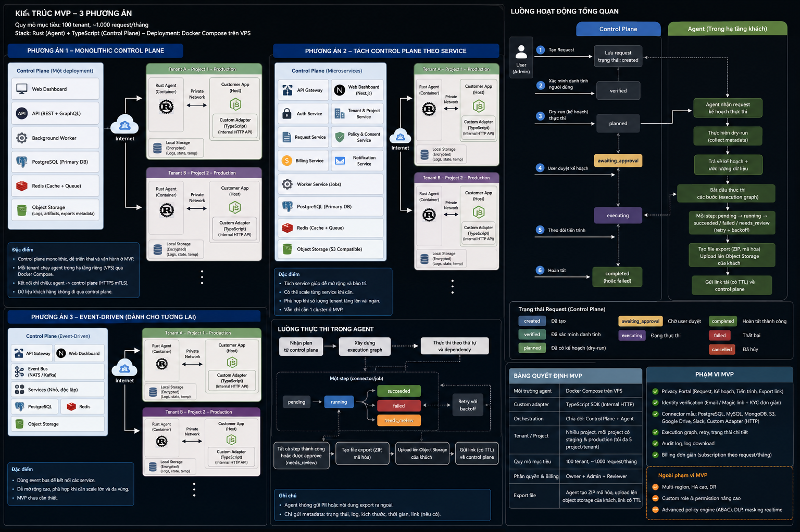

# ForgetOps System Design

**Date:** 2026-07-21  
**Status:** Approved design baseline  
**Audience:** Solo developer implementing the MVP  
**Delivery model:** Hosted TypeScript control plane + self-hosted Rust agent



## Executive summary

ForgetOps automates two data-lifecycle workflows for small AI SaaS teams: **Delete account** and **Export my data**. A hosted control plane manages tenant configuration, request state, approvals, notifications, billing, and sanitized audit metadata. A Rust agent runs in the customer's Docker Compose environment and keeps all raw subject identifiers, connector credentials, discovery results, destructive execution details, export files, and encryption keys inside the customer's data plane.

The design optimizes for a solo developer and an initial target of 100 tenants and approximately 1,000 privacy requests per month. It uses a modular monolith rather than microservices, PostgreSQL as the source of truth, Redis-backed workers, signed agent commands, WebSocket delivery with polling fallback, dry-run and approval by default, and independent retryable connector steps.

## Design principles

1. **Data stays with the customer.** The hosted system does not process export content or connector records.
2. **Destructive actions require cryptographic authorization.** UI state alone cannot trigger deletion.
3. **Plan before execution.** Every destructive workflow binds approval to an exact plan fingerprint and version.
4. **Partial failure is explicit.** Cross-service rollback is not promised.
5. **The MVP remains operable by one developer.** Complexity is added only when it protects data or materially improves onboarding.
6. **Legal policy belongs to the customer.** ForgetOps executes configured policy and does not claim to determine legal obligations.

---
# Product Scope

## 1. Product statement

ForgetOps is a data lifecycle runtime for small AI SaaS teams. It gives developers one controlled workflow to discover, export, erase, anonymize, retain, and verify a user's data across application databases and third-party services.

The MVP is not a broad privacy-compliance suite. It focuses on two high-risk engineering jobs:

- A user asks for a copy of their data.
- A user asks for account and data deletion.

## 2. Primary user

The primary customer is a technical founder or small engineering team operating an AI SaaS with a stack similar to:

- Supabase for PostgreSQL, storage, and authentication-adjacent data
- Clerk for user identity
- Stripe for billing records
- A vector database, custom service, or internal database accessed through the custom adapter SDK

The team does not have a dedicated privacy engineering or compliance operations function.

## 3. User roles

### Owner

- Creates the tenant
- Manages billing
- Adds or removes members
- Creates projects and environments
- Pairs or revokes agents
- Changes destructive-operation policy

### Admin

- Configures connectors
- Creates administrative requests
- Reviews request details
- Manages privacy portal configuration
- Retries failed steps

### Reviewer

- Reviews dry-run plans
- Approves or rejects destructive operations
- Accepts justified retention outcomes
- Downloads audit reports

## 4. Core user journeys

### 4.1 Administrative deletion request

1. Admin selects project and production environment.
2. Admin submits a subject identifier in the browser.
3. Browser encrypts the identifier to the environment agent's public key.
4. Control plane creates a request containing only ciphertext and operational metadata.
5. Agent decrypts, normalizes the subject, computes the keyed subject hash, and discovers data.
6. Agent returns a sanitized plan with counts, actions, and risks.
7. Reviewer approves the exact plan version.
8. Control plane signs an execution authorization.
9. Agent executes independent steps, retries failures, and verifies outcomes.
10. Control plane shows completion, retained items, and unresolved steps.

### 4.2 End-user deletion request

1. User opens the project's privacy portal.
2. User authenticates through a short-lived assertion produced after Clerk reauthentication.
3. If reauthentication is unavailable, the customer identity adapter performs a magic-link challenge.
4. Control plane creates a verified privacy request without retaining raw identity data.
5. The remaining flow is the same as the administrative request.

### 4.3 Data export request

1. Verified request enters planning.
2. Agent discovers exportable records and generates a sanitized plan.
3. After approval or policy-based auto-authorization, connectors collect data locally.
4. Agent creates a structured archive and manifest.
5. Agent encrypts the archive and uploads it to customer-owned object storage.
6. The privacy portal receives a short-lived download capability and an encrypted key envelope.
7. Browser decrypts the key envelope after identity verification.
8. Link and archive expire according to project policy.

## 5. Functional requirements

### Request management

- Create delete and export requests from dashboard, API, or privacy portal.
- Support idempotency keys on every create and execute operation.
- Enforce one active destructive request per subject and environment unless explicitly overridden by an owner.
- Allow cancellation before execution authorization.
- Prevent cancellation after an irreversible step has started; use compensating status instead.

### Identity handling

- Never store raw email, user ID, or external identifiers in control-plane business tables.
- Store a keyed HMAC subject hash for correlation within one environment.
- Encrypt the raw subject to the agent public key before persistence or transit through the control plane.
- Delete subject ciphertext after the agent binds the request or after a maximum 24-hour TTL.

### Planning

- Every delete workflow runs discovery before execution.
- Plans include connector, resource type, action, estimated count, risk, dependency summary, and retention reason category.
- Plan approval binds to request ID, environment ID, plan ID, plan version, and expiry.
- Any material re-plan invalidates previous approval.

### Execution

- Independent connectors continue when another connector fails.
- Each step is idempotent and independently retryable.
- Agent verifies the result of destructive actions.
- A request completes only when all steps are succeeded, skipped by policy, or accepted as retained/needs-review.
- Control plane never sends an unsigned delete command.

### Export

- Export data remains in the customer data plane.
- Archive contains a machine-readable manifest and human-readable index.
- Archive is encrypted before upload.
- Storage is customer-owned and private.
- Access link expires and can be revoked.

### Audit

- Every state transition emits an append-only audit event.
- Audit events form a tamper-evident hash chain per environment.
- Audit metadata excludes raw PII and record contents.
- Reports show action, actor, timestamps, plan version, connector outcomes, counts, and retention categories.

## 6. Non-functional requirements

### Availability

- Control plane target: 99.5% monthly availability for the MVP.
- Agent tolerates control-plane disconnects and resumes through polling.
- Destructive jobs require a valid unexpired authorization even after reconnection.

### Performance

- Dashboard reads: p95 below 500 ms under normal MVP load.
- Agent heartbeat interval: 30 seconds while connected.
- Job delivery: under 10 seconds through WebSocket, under 60 seconds through polling fallback.
- Planning and execution durations depend on connector APIs and are reported independently.

### Scale

- 100 tenants
- Up to 5 projects per tenant
- Staging and production per project
- About 1,000 privacy requests per month
- One active agent per environment in the MVP

### Security

- TLS for all remote transport.
- Ed25519 signatures for agent and control-plane commands.
- Encryption at rest for sensitive local agent state.
- Least-privilege connector credentials.
- No control-plane access to customer records or export content.

## 7. Non-goals

The MVP does not include:

- Automatic legal interpretation by country
- A universal data catalog
- Data loss prevention or real-time content inspection
- Enterprise custom RBAC
- Kubernetes deployment
- Multi-region control plane
- Customer-managed control-plane encryption keys
- Automatic deletion from immutable backups
- Full workflow rollback after deletion
- Support for every vector database
- A guarantee of regulatory compliance

## 8. Success metrics

### Activation

- Tenant pairs a production agent and completes a dry-run within 30 minutes.
- At least three connectors are healthy.

### Reliability

- More than 95% of connector steps complete without manual intervention after initial configuration.
- Zero unauthorized destructive executions.
- Zero raw-PII control-plane log incidents.

### Product value

- Median manual engineering time per request is reduced by at least 80% in pilot customers.
- At least 50% of activated tenants complete a second request within 60 days or enable automatic account-closure cleanup.

## 9. Product boundary statement

ForgetOps decides **how to execute configured data handling policy**, not **what the law requires**. A project administrator owns retention rules and connector scope. The product must preserve this distinction in UI copy, documentation, and contracts.


---

# System Architecture

## 1. Architecture choice

The MVP uses a **modular monolith control plane** and a **separate self-hosted data-plane agent**.

This choice minimizes operational burden for a solo developer while preserving clear boundaries that can be extracted later. Microservices and a full event bus are intentionally deferred.

## 2. Trust boundaries

```text
Hosted Control Plane                  Customer Data Plane
--------------------------------      --------------------------------
Tenant/project configuration          Raw subject identity
Request lifecycle                     Supabase/Stripe/Clerk credentials
Plan projection                       Connector responses
Approval metadata                     Record IDs and contents
Step counts and status                Full execution graph
Audit metadata                        Export archive and encryption keys
Billing and notifications             Temporary workspace
```

The control plane is not trusted with customer application data. The agent is trusted to execute approved policy within one environment.

## 3. Control-plane components

### Web application

Responsibilities:

- Owner/admin/reviewer dashboard
- Privacy portal
- Request review and approval
- Agent and connector status
- Audit report rendering
- Billing and tenant settings

Recommended implementation: Next.js with server-side rendering for authenticated pages and a small client surface for live request progress.

### API application

Responsibilities:

- REST endpoints
- WebSocket agent gateway
- Authentication and authorization
- State-machine commands
- Agent pairing and key rotation
- Signed execution authorization
- Webhooks for customer applications

Recommended implementation: Fastify with Zod-based validation and OpenAPI generation.

### Background worker

Responsibilities:

- Notification delivery
- Request deadline reminders
- Agent offline detection
- Expired authorization cleanup
- Outbox event processing
- Billing usage aggregation

Recommended implementation: BullMQ backed by Redis.

### PostgreSQL

Source of truth for:

- Tenants and memberships
- Projects and environments
- Agent public identities
- Connector metadata
- Privacy request lifecycle
- Sanitized plans and step projections
- Approvals
- Audit chain
- Job and outbox state

### Redis

Used for:

- Background queues
- Short-lived rate limits
- WebSocket presence
- Idempotency response cache

Redis is not the source of truth for request state.

## 4. Agent components

### Connection manager

- Maintains outbound WebSocket connection.
- Falls back to authenticated HTTPS polling.
- Handles reconnect, jitter, and server backoff instructions.
- Never opens an inbound public port.

### Command verifier

- Verifies control-plane signatures.
- Checks environment, request, plan version, expiry, and nonce.
- Rejects replayed or stale execution authorization.

### Workflow engine

- Converts a sanitized plan plus local discovery results into an execution DAG.
- Persists local step state.
- Leases runnable steps.
- Applies retry and backoff.
- Supports cancellation before irreversible execution begins.

### Connector runtime

- Loads official connector configuration.
- Calls Supabase, Stripe, and Clerk APIs.
- Calls custom TypeScript adapter through private HTTP.
- Enforces connector capabilities and credential scopes.

### Local state store

SQLite database containing:

- Encrypted subject envelope after decryption
- Full discovery output
- Execution graph
- Step attempt history
- Export artifact manifest
- Local audit details

Sensitive columns are encrypted using XChaCha20-Poly1305 with a master key supplied through a Docker secret.

### Export builder

- Normalizes connector output into a documented archive layout.
- Produces `manifest.json` and `index.html`.
- Creates an archive.
- Encrypts archive content.
- Uploads to customer-owned object storage.
- Returns only sanitized metadata and capability references.

## 5. Data flow: delete request

```text
Admin/User
  -> browser encrypts subject to agent public key
  -> Control Plane creates request
  -> Agent receives planning job
  -> Agent decrypts and computes subject HMAC
  -> Connectors discover matching resources
  -> Agent creates local DAG and sanitized plan
  -> Control Plane stores plan projection
  -> Reviewer approves exact plan version
  -> Control Plane signs execution authorization
  -> Agent verifies authorization
  -> Agent executes independent steps
  -> Agent verifies each connector outcome
  -> Agent sends sanitized progress events
  -> Control Plane closes request or marks partial failure
```

## 6. Data flow: export request

```text
Verified request
  -> discovery and plan
  -> authorization
  -> connector exports to local workspace
  -> archive builder normalizes data
  -> archive encrypted with random data key
  -> archive uploaded to customer object storage
  -> data key encrypted to privacy-portal ephemeral public key
  -> control plane stores encrypted key envelope and expiring link metadata
  -> verified browser decrypts key and downloads archive
  -> archive and link expire
```

## 7. Control-plane module boundaries

```text
modules/
  identity-access/
  tenants-projects/
  agent-management/
  connector-registry/
  privacy-requests/
  identity-verification/
  execution-plans/
  approvals/
  audit/
  notifications/
  billing/
```

Rules:

- Each module owns its tables and repository interfaces.
- Cross-module communication uses application services or internal domain events.
- No module imports another module's database repository.
- Public module APIs use shared domain contracts, not ORM models.
- State transitions occur through command methods, not direct status updates.

## 8. Suggested repository structure

```text
forgetops/
  apps/
    web/                  # Next.js dashboard and privacy portal
    api/                  # Fastify REST and agent gateway
    worker/               # BullMQ jobs
  packages/
    contracts/            # Zod schemas and generated JSON Schema
    domain/               # State machines, value objects, policies
    database/             # Drizzle schema and migrations
    auth/                 # Clerk-backed admin authentication and RBAC
    observability/        # Logging, metrics, tracing helpers
    testing/              # Fixtures and Testcontainers helpers
  agent/
    crates/
      agent-core/
      agent-protocol/
      agent-store/
      connector-sdk/
      connector-supabase/
      connector-stripe/
      connector-clerk/
      adapter-http/
      export-builder/
    bin/forgetops-agent/
  sdk/
    typescript/
  deploy/
    control-plane/
    agent-compose/
  docs/
```

## 9. Deployment topology

### Hosted

- Web application
- API application
- Worker process
- Managed PostgreSQL
- Managed Redis
- S3-compatible metadata storage, excluding export payloads

The applications may run from one container image with separate commands. This preserves a modular monolith while allowing web, API, and worker processes to scale independently.

### Customer environment

```text
Docker Compose
  forgetops-agent
  customer-app or custom-adapter
  encrypted state volume
  Docker secrets
  outbound Internet access
```

## 10. Evolution path

Extract a service only when one of these conditions is met:

- Independent scaling is repeatedly required.
- A module needs a different availability or security boundary.
- Deployment coupling causes measurable release risk.
- A separate team owns the module.

Likely first extractions:

1. Agent gateway
2. Notification worker
3. Audit/report service

The privacy-request state machine remains the source of truth until there is a proven reason to split it.


---

# Domain and Data Model

## 1. Aggregate overview

```text
Tenant
  Project
    Environment
      Agent
      Connector
      Policy
      PrivacyRequest
        ExecutionPlan
        ExecutionStepProjection
        Approval
        AuditEvent
```

`PrivacyRequest` is the primary business aggregate. The agent owns the detailed execution graph; the control plane stores a sanitized projection.

## 2. Tenant and membership

```ts
export type Role = "owner" | "admin" | "reviewer";

export interface Tenant {
  id: string;
  name: string;
  plan: "trial" | "starter" | "team";
  createdAt: string;
}

export interface Membership {
  tenantId: string;
  userId: string;
  role: Role;
  createdAt: string;
}
```

Authorization rules:

- Every tenant has at least one owner.
- Only owners manage billing and destructive-operation defaults.
- Owners and admins create requests.
- Owners, admins, and reviewers can approve when separation-of-duty policy allows it.
- The request creator cannot approve their own destructive request when two-person approval is enabled.

## 3. Project and environment

```ts
export interface Project {
  id: string;
  tenantId: string;
  name: string;
  slug: string;
  createdAt: string;
}

export interface Environment {
  id: string;
  projectId: string;
  kind: "staging" | "production";
  status: "active" | "disabled";
  subjectHashKeyVersion: number;
  createdAt: string;
}
```

Constraints:

- Maximum five projects per tenant in the MVP.
- Exactly one staging and one production environment per project.
- Credentials, agents, subject hashes, and requests are environment-scoped.
- Data cannot be moved between staging and production.

## 4. Agent

```ts
export interface Agent {
  id: string;
  environmentId: string;
  publicSigningKey: string;
  publicEncryptionKey: string;
  version: string;
  protocolVersion: string;
  status: "pairing" | "online" | "offline" | "outdated" | "revoked";
  lastSeenAt: string | null;
  lastSequence: string;
  createdAt: string;
}
```

Only one active agent is allowed per environment in the MVP. Pairing a replacement revokes the previous agent after explicit owner confirmation.

## 5. Connector metadata

```ts
export type ConnectorCapability =
  | "discover"
  | "export"
  | "delete"
  | "anonymize"
  | "retain"
  | "verify";

export interface ConnectorMetadata {
  id: string;
  environmentId: string;
  type: "supabase" | "stripe" | "clerk" | "custom";
  displayName: string;
  capabilities: ConnectorCapability[];
  status: "connected" | "degraded" | "disabled";
  configurationFingerprint: string;
  lastHealthCheckAt: string | null;
}
```

The control plane stores no connector secret or endpoint credential.

## 6. Privacy request

```ts
export type PrivacyRequestType = "delete" | "export";
export type PrivacyRequestSource = "admin" | "privacy_portal" | "api";

export type PrivacyRequestStatus =
  | "created"
  | "identity_verification_pending"
  | "identity_verified"
  | "planning"
  | "awaiting_approval"
  | "execution_authorized"
  | "executing"
  | "completed"
  | "partially_completed"
  | "failed"
  | "cancelled";

export interface PrivacyRequest {
  id: string;
  environmentId: string;
  type: PrivacyRequestType;
  source: PrivacyRequestSource;
  subjectHash: string | null;
  status: PrivacyRequestStatus;
  policyVersion: number;
  deadlineAt: string;
  createdByActorId: string;
  createdAt: string;
  completedAt: string | null;
  version: number;
}
```

The `version` field implements optimistic concurrency control.

## 7. State machine

### Allowed transitions

```text
created -> identity_verification_pending
created -> identity_verified                 # trusted administrative API
identity_verification_pending -> identity_verified
identity_verification_pending -> cancelled
identity_verified -> planning
planning -> awaiting_approval
planning -> execution_authorized             # approved auto-execution policy
planning -> failed
awaiting_approval -> execution_authorized
awaiting_approval -> cancelled
execution_authorized -> executing
execution_authorized -> cancelled             # authorization not consumed
executing -> completed
executing -> partially_completed
executing -> failed
```

Forbidden transitions are rejected at the domain layer and recorded as security events.

## 8. Subject identity

Raw subject identifiers exist only in encrypted envelopes and local agent state.

```ts
export interface SubjectEnvelope {
  requestId: string;
  environmentId: string;
  ciphertext: string;
  encryptionKeyId: string;
  expiresAt: string;
  consumedAt: string | null;
}
```

The agent normalizes identifiers and returns:

```text
subjectHash = HMAC-SHA-256(environmentSubjectKey, canonicalIdentity)
```

The environment subject key remains in the customer data plane. The control plane cannot perform an offline dictionary attack against email hashes.

## 9. Execution plan

```ts
export interface ExecutionPlan {
  id: string;
  requestId: string;
  version: number;
  fingerprint: string;
  status: "draft" | "approved" | "rejected" | "expired";
  totalSteps: number;
  estimatedRecords: number;
  requiresApproval: boolean;
  generatedAt: string;
  expiresAt: string;
}
```

A plan fingerprint covers the canonical sanitized plan. Approval is invalid if the fingerprint or version changes.

## 10. Step projection

```ts
export type StepStatus =
  | "pending"
  | "running"
  | "succeeded"
  | "failed"
  | "needs_review"
  | "skipped";

export interface ExecutionStepProjection {
  id: string;
  requestId: string;
  planVersion: number;
  connectorType: string;
  resourceType: string;
  action: "export" | "delete" | "anonymize" | "retain" | "verify";
  risk: "low" | "medium" | "high";
  status: StepStatus;
  estimatedCount: number | null;
  affectedCount: number | null;
  errorCategory: string | null;
  startedAt: string | null;
  completedAt: string | null;
}
```

Record IDs, queries, and contents are excluded.

## 11. Approval and authorization

```ts
export interface Approval {
  id: string;
  requestId: string;
  planId: string;
  planVersion: number;
  planFingerprint: string;
  decision: "approved" | "rejected";
  decidedBy: string;
  comment: string | null;
  createdAt: string;
}
```

Execution authorization is a signed immutable document:

```ts
export interface ExecutionAuthorizationClaims {
  issuer: "forgetops-control-plane";
  environmentId: string;
  agentId: string;
  requestId: string;
  planId: string;
  planVersion: number;
  planFingerprint: string;
  issuedAt: string;
  expiresAt: string;
  nonce: string;
}
```

## 12. Audit event

```ts
export interface AuditEvent {
  id: string;
  tenantId: string;
  environmentId: string;
  requestId: string | null;
  actorType: "user" | "agent" | "system";
  actorId: string;
  action: string;
  metadata: Record<string, string | number | boolean | null>;
  previousEventHash: string | null;
  eventHash: string;
  createdAt: string;
}
```

Hash calculation:

```text
eventHash = SHA-256(previousEventHash || canonicalJson(eventWithoutHashes))
```

The application serializes events using RFC 8785-style canonical JSON rules before hashing.

## 13. Core database tables

```text
tenants
memberships
projects
environments
agents
agent_pairing_tokens
connectors
policies
privacy_requests
subject_envelopes
execution_plans
execution_step_projections
approvals
execution_authorizations
agent_jobs
job_leases
outbox_events
audit_events
notifications
billing_accounts
usage_records
```

## 14. Database integrity rules

- Unique membership on `(tenant_id, user_id)`.
- Unique environment on `(project_id, kind)`.
- Unique active agent on `environment_id` through a partial index.
- Unique idempotency key on `(environment_id, idempotency_key)`.
- Unique active request on `(environment_id, subject_hash, type)` where status is not terminal.
- Approval must reference the current plan version.
- Audit events cannot be updated or deleted by the application role.
- Tenant ID is copied onto high-volume tables for efficient authorization filters.

## 15. Outbox pattern

Every state transition and its internal event are committed in one PostgreSQL transaction:

```text
BEGIN
  update privacy_requests
  insert audit_events
  insert outbox_events
COMMIT
```

The worker publishes the outbox event to Redis-backed jobs. Delivery is at least once; consumers must be idempotent.


---

# Agent-Control Plane Protocol

## 1. Goals

The protocol must:

- Keep all connections outbound from the customer network.
- Authenticate both control plane and agent.
- Prevent replay and cross-environment commands.
- Support near-real-time WebSocket delivery and polling fallback.
- Tolerate duplicate delivery.
- Avoid transmitting raw PII in progress events.
- Preserve safe execution after disconnect and restart.

## 2. Protocol versions

Every message includes:

```json
{
  "protocolVersion": "1.0",
  "messageType": "job.available",
  "messageId": "msg_01...",
  "environmentId": "env_01...",
  "agentId": "agt_01...",
  "sequence": "1042",
  "sentAt": "2026-07-21T10:00:00Z",
  "payload": {},
  "signature": "base64url(...)"
}
```

Unknown major versions are rejected. Unknown minor fields are ignored.

## 3. Pairing

### Control-plane preparation

1. Owner creates an environment.
2. Control plane generates a one-time pairing token valid for 15 minutes.
3. Token is shown once.

### Agent initialization

1. Agent generates:
   - Ed25519 signing key pair
   - X25519 encryption key pair
   - Local environment subject-HMAC key
2. Private keys are written to Docker-secret-backed storage.
3. Agent sends pairing token, public keys, protocol version, and instance fingerprint.
4. Control plane binds the public keys to the environment.
5. Pairing token is destroyed.

### Replacement

A new agent cannot silently replace an active production agent. Owner must approve replacement. Previous agent is revoked and cannot lease new jobs.

## 4. Transport

### Primary: WebSocket

- Endpoint: `wss://api.forgetops.example/v1/agent-stream`
- Authentication: signed `agent.hello` message plus short-lived connection challenge.
- Heartbeat: every 30 seconds.
- Server closes silent connections after 90 seconds.

### Fallback: HTTPS polling

- Endpoint: `POST /v1/agent-jobs/poll`
- Long-poll timeout: 45 seconds.
- Agent uses exponential reconnect backoff with jitter, capped at 60 seconds.

## 5. Message signing

Signature input:

```text
SHA-256(protocolVersion || messageType || messageId || environmentId ||
        agentId || sequence || sentAt || canonicalJson(payload))
```

The sender signs the digest using Ed25519. The receiver verifies:

- public key
- environment and agent binding
- timestamp freshness
- monotonic sequence
- unseen message ID

Message IDs are retained in replay cache for at least 24 hours.

## 6. Job model

```ts
export interface AgentJob {
  jobId: string;
  requestId: string;
  environmentId: string;
  kind: "bind_subject" | "plan" | "execute" | "cancel" | "health_check";
  planVersion: number | null;
  payloadCiphertext: string | null;
  authorization: string | null;
  availableAt: string;
  expiresAt: string;
  attempt: number;
}
```

## 7. Leasing

1. Agent receives `job.available`.
2. Agent requests a lease.
3. Control plane atomically marks job leased to that agent for 60 seconds.
4. Agent sends heartbeat every 20 seconds while running.
5. Lease extends only while agent remains valid.
6. If lease expires, job becomes available again.

A job may be delivered more than once. Agent deduplicates by `jobId` and persisted execution state.

## 8. Planning flow

```text
job: bind_subject
  -> decrypt subject envelope
  -> normalize identity
  -> compute environment-scoped HMAC
  -> return subject.bound

job: plan
  -> discover across enabled connectors
  -> build local execution graph
  -> save graph and raw discovery locally
  -> return sanitized plan projection
```

Sanitized plan response:

```json
{
  "requestId": "req_01...",
  "planVersion": 3,
  "planFingerprint": "sha256:...",
  "steps": [
    {
      "stepId": "step_01...",
      "connectorType": "supabase",
      "resourceType": "documents",
      "action": "delete",
      "estimatedCount": 17,
      "risk": "medium"
    }
  ]
}
```

## 9. Execution authorization

The control plane signs an authorization after approval or valid auto-execution policy.

Agent checks:

- Signature matches configured control-plane public key.
- Environment and agent IDs match local configuration.
- Request and plan exist locally.
- Plan fingerprint and version match.
- Authorization is unexpired.
- Nonce has not been consumed.
- Current policy does not require a stronger local guard.

The nonce is persisted as consumed before the first destructive step begins.

## 10. Progress events

Allowed metadata:

- request ID
- step ID
- connector type
- resource type category
- action
- status
- affected count
- duration
- retry attempt
- normalized error category

Prohibited metadata:

- raw subject identifiers
- record IDs
- file paths containing user identifiers
- SQL or API response bodies
- exported data
- connector secrets

## 11. Retry policy

Default connector retry:

```text
Attempt 1: immediate
Attempt 2: 5 seconds + jitter
Attempt 3: 30 seconds + jitter
Attempt 4: 2 minutes + jitter
Attempt 5: 10 minutes + jitter
```

Do not retry:

- invalid credentials
- authorization mismatch
- unsupported capability
- policy violation
- deterministic validation error

Retry with server guidance:

- rate limit
- remote timeout
- temporary network failure
- service unavailable

## 12. Idempotency

Each operation uses:

```text
operationKey = requestId + planVersion + stepId + actionVersion
```

Official connectors persist operation markers locally before and after calls. When a remote API lacks idempotency support, verification determines whether the intended final state already exists.

## 13. Cancellation

Cancellation is advisory until acknowledged by the agent.

- Planning jobs can always be cancelled.
- Authorized jobs can be cancelled before the nonce is consumed.
- During execution, the agent stops scheduling new steps.
- Running steps finish unless connector cancellation is safe.
- Completed destructive steps are not rolled back.
- Request becomes `partially_completed` if irreversible work occurred.

## 14. Offline behavior

- Agent may continue an already authorized workflow while disconnected if authorization remains valid.
- Progress events are queued locally and sent after reconnect.
- Agent cannot start a new destructive workflow from an expired authorization.
- Agent never infers approval from control-plane unavailability.

## 15. Protocol errors

```text
AUTH_SIGNATURE_INVALID
AUTH_AGENT_REVOKED
AUTH_ENVIRONMENT_MISMATCH
AUTH_REPLAY_DETECTED
JOB_LEASE_EXPIRED
JOB_PAYLOAD_UNREADABLE
PLAN_VERSION_MISMATCH
AUTHORIZATION_EXPIRED
AUTHORIZATION_ALREADY_CONSUMED
PROTOCOL_VERSION_UNSUPPORTED
```

Security errors are not automatically retried and generate control-plane alerts.


---

# Connectors and TypeScript Adapter SDK

## 1. Connector philosophy

A connector is not a generic CRUD wrapper. It implements a small, auditable lifecycle contract for a known system.

Every connector declares capabilities and must support dry-run planning separately from execution.

## 2. Rust connector contract

```rust
#[async_trait::async_trait]
pub trait Connector: Send + Sync {
    fn descriptor(&self) -> ConnectorDescriptor;

    async fn health_check(&self) -> Result<HealthStatus, ConnectorError>;

    async fn discover(
        &self,
        subject: &SubjectIdentity,
        request: &DiscoveryRequest,
    ) -> Result<DiscoveryResult, ConnectorError>;

    async fn export(
        &self,
        subject: &SubjectIdentity,
        selection: &ExportSelection,
        sink: &mut dyn ExportSink,
    ) -> Result<ExportResult, ConnectorError>;

    async fn erase(
        &self,
        subject: &SubjectIdentity,
        plan: &ErasePlan,
        context: &ExecutionContext,
    ) -> Result<EraseResult, ConnectorError>;

    async fn verify(
        &self,
        subject: &SubjectIdentity,
        expectation: &VerificationExpectation,
    ) -> Result<VerificationResult, ConnectorError>;
}
```

## 3. Capability rules

- `discover` is mandatory.
- `verify` is mandatory for every destructive capability.
- `delete` means remote data can be deleted.
- `anonymize` means identifiable fields can be irreversibly replaced or removed.
- `retain` means the connector can document a configured retention result.
- `export` means the connector can write normalized data into the export sink.

A connector cannot advertise `delete` without `verify`.

## 4. Discovery result

Raw result remains local. The control plane receives a projection.

```rust
pub struct DiscoveryItem {
    pub local_reference: String,
    pub resource_type: String,
    pub proposed_action: ProposedAction,
    pub estimated_count: u64,
    pub risk: RiskLevel,
    pub dependencies: Vec<String>,
    pub retention_reason: Option<String>,
}
```

`local_reference` is encrypted in the agent store and never sent to the control plane.

## 5. Official connector: Supabase

Scope:

- PostgreSQL records configured through declarative table mappings
- Supabase Storage objects configured through bucket/path mapping
- Optional Auth user deletion when the project explicitly enables it

Example policy:

```yaml
connectors:
  supabase:
    tables:
      profiles:
        identity_column: user_id
        delete: true
      documents:
        identity_column: owner_id
        delete: true
      audit_events:
        identity_column: actor_user_id
        action: anonymize
        fields: [actor_user_id, actor_email]
    storage:
      user-uploads:
        prefix: "users/{user_id}/"
        delete: true
```

Safety:

- Table and column names are allowlisted at configuration time.
- Agent uses parameterized queries only.
- Discovery and execution run in transactions where practical.
- Cascades are inspected during health validation and shown as high risk.

## 6. Official connector: Stripe

Scope:

- Discover customer by configured stable mapping.
- Export customer, subscriptions, payment methods, and selected billing objects.
- Apply configured deletion/anonymization operations supported by the customer account and API.
- Mark financial objects retained when project policy requires retention.

ForgetOps does not assume all Stripe data can or should be deleted. The connector returns one of:

- deleted
- anonymized
- retained_by_policy
- unsupported
- needs_review

## 7. Official connector: Clerk

Scope:

- Discover user identity and linked external accounts.
- Export supported profile and identity data.
- Revoke sessions before destructive execution.
- Delete the identity when policy and API capability allow it.
- Verify that active sessions and user identity are absent or disabled.

Default delete dependency:

```text
revoke_sessions -> disable_application_access -> delete_downstream_data -> delete_identity
```

Clerk identity deletion is scheduled after application data deletion to preserve mapping during discovery and execution.

## 8. Custom TypeScript adapter

The adapter runs in the customer's application or a private sidecar. The Rust agent calls it over a private network.

### Package API

```ts
import {
  createForgetOpsAdapter,
  type SubjectIdentity,
  type ResourceDefinition,
} from "@forgetops/adapter";

const documents: ResourceDefinition = {
  name: "documents",
  capabilities: ["discover", "export", "delete", "verify"],

  async discover({ subject, db }) {
    const count = await db.document.count({
      where: { ownerId: subject.userId },
    });
    return { estimatedCount: count, proposedAction: "delete", risk: "medium" };
  },

  async export({ subject, db, writer }) {
    const rows = await db.document.findMany({
      where: { ownerId: subject.userId },
    });
    await writer.json("documents/documents.json", rows);
    return { exportedCount: rows.length };
  },

  async erase({ subject, db, operationKey }) {
    const result = await db.document.deleteMany({
      where: { ownerId: subject.userId },
    });
    return { operationKey, affectedCount: result.count };
  },

  async verify({ subject, db }) {
    const remaining = await db.document.count({
      where: { ownerId: subject.userId },
    });
    return { satisfied: remaining === 0, remainingCount: remaining };
  },
};

export default createForgetOpsAdapter({ resources: [documents] });
```

## 9. Adapter HTTP protocol

Private endpoints:

```text
POST /forgetops/v1/health
POST /forgetops/v1/discover
POST /forgetops/v1/export
POST /forgetops/v1/erase
POST /forgetops/v1/verify
POST /forgetops/v1/identity/send-magic-link
POST /forgetops/v1/identity/verify-magic-link
```

Requests are signed by the agent using an adapter-specific shared secret delivered through Docker secrets. Each request includes timestamp, nonce, and body digest. The adapter rejects requests older than 60 seconds or reused nonces.

## 10. Adapter isolation

- Endpoint is bound to a private Docker network or loopback.
- No public ingress is required.
- Adapter code uses the customer's own database client and business logic.
- Raw results return only to the local agent.
- Adapter logs must use the provided redacting logger.

## 11. Connector configuration lifecycle

1. Admin selects connector type in dashboard.
2. Control plane produces non-secret configuration template.
3. Customer adds secrets to Docker Compose.
4. Agent loads configuration and performs health checks.
5. Agent sends fingerprint and capability metadata.
6. Admin enables connector for staging, then production.

Configuration changes create a new fingerprint and invalidate unexecuted plans that used the previous fingerprint.

## 12. Connector error taxonomy

```text
CREDENTIAL_INVALID
PERMISSION_INSUFFICIENT
RESOURCE_MAPPING_INVALID
SUBJECT_NOT_FOUND
RATE_LIMITED
REMOTE_TIMEOUT
REMOTE_UNAVAILABLE
ACTION_UNSUPPORTED
POLICY_REQUIRES_REVIEW
VERIFICATION_FAILED
DATA_CONFLICT
ADAPTER_PROTOCOL_ERROR
```

Connector error messages sent to the control plane are sanitized. Detailed remote responses remain local.


---

# Security, Privacy, and Threat Model

## 1. Security objectives

1. A control-plane compromise must not expose customer records, connector credentials, or export contents.
2. No destructive operation may run without valid policy authorization.
3. Commands and progress events must not be replayable across requests or environments.
4. One tenant must not access another tenant's metadata.
5. Logs and telemetry must not leak raw subject identifiers.
6. Compromised custom adapter code must be constrained to the customer's own environment and declared resources.

## 2. Data classification

### Restricted

- Raw email, user ID, external IDs
- Connector credentials
- Record contents
- Export archive
- Archive encryption keys
- Full discovery graph

Location: customer data plane only.

### Confidential metadata

- Subject HMAC
- Request status
- Connector names and resource categories
- Counts and normalized error categories
- Approval identities
- Audit events

Location: control plane with tenant isolation.

### Operational

- Agent version
- Heartbeats
- Latency and retry metrics
- Protocol version

## 3. Threat actors

- Internet attacker targeting the hosted control plane
- Attacker with a stolen admin session
- Malicious or compromised customer employee
- Compromised agent host
- Compromised custom adapter
- Supply-chain compromise in an agent or npm dependency
- Accidental operator error
- Cross-tenant application bug

## 4. Trust boundaries

```text
Browser <-> Hosted control plane
Hosted control plane <-> Customer agent
Customer agent <-> Official SaaS APIs
Customer agent <-> Custom adapter
Customer agent <-> Customer object storage
```

Every boundary authenticates independently.

## 5. Threats and mitigations

### Control-plane database exfiltration

Risk: attacker obtains request metadata and subject hashes.

Mitigations:

- Subject hashes use customer-held keyed HMAC secrets.
- Raw subject envelope is encrypted to agent and deleted after binding.
- No connector secrets or export data are stored.
- Database encryption and strict production access are still required.

### Stolen pairing token

Risk: attacker pairs a fake agent.

Mitigations:

- Token valid for 15 minutes and one use.
- Pairing requires authenticated owner action.
- Production replacement requires explicit confirmation.
- Pairing event sends an out-of-band notification.

### Forged delete command

Risk: attacker sends an execution message directly to agent.

Mitigations:

- Control-plane Ed25519 signature.
- Exact environment, agent, request, plan version, fingerprint, expiry, and nonce binding.
- Nonce persisted before destructive execution.
- Agent rejects unsigned local requests.

### Replay attack

Risk: a valid authorization is reused.

Mitigations:

- Single-use nonce.
- Monotonic sequence numbers.
- Message ID replay cache.
- Authorization expiry.
- Idempotent step operation keys.

### Stale-plan approval

Risk: data changes after reviewer approval.

Mitigations:

- Approval binds to plan fingerprint and connector configuration fingerprint.
- Material re-plan invalidates approval.
- Agent checks current local plan before execution.

### Cross-tenant metadata access

Risk: application bug exposes another tenant.

Mitigations:

- Tenant-scoped repository interfaces.
- Authorization middleware requires tenant and environment context.
- Database RLS used as defense in depth for dashboard reads.
- Cross-tenant property tests and penetration tests.

### PII leakage through logs

Mitigations:

- Structured logging schema with allowlisted fields.
- Redacting logger in TypeScript and Rust.
- CI tests inject canary emails and fail if they appear in logs.
- Remote API bodies never sent to telemetry.

### Compromised custom adapter

Mitigations:

- Adapter already runs with customer application privileges; ForgetOps does not expand those privileges.
- Private network only.
- Signed requests and nonce validation.
- Resource allowlist.
- Agent validates response schema and maximum payload size.
- Adapter cannot issue control-plane commands.

### Export link leakage

Mitigations:

- Customer-owned private bucket.
- Short-lived presigned URL.
- Archive encrypted with random data key.
- Data key encrypted to browser ephemeral public key.
- Link revocation and single-download option.
- Portal requires recent identity verification.

### Agent host compromise

Mitigations:

- Least-privilege connector credentials.
- Docker secrets, read-only root filesystem, dropped Linux capabilities.
- Encrypted local sensitive fields.
- Automatic local cleanup.
- Signed agent releases and documented upgrade channel.

## 6. Key hierarchy

### Agent keys

- Ed25519 signing private key
- X25519 decryption private key
- Environment subject-HMAC key
- Local state encryption key

Stored through Docker secrets or a mounted secret file with owner-only permissions.

### Control-plane keys

- Ed25519 execution-authorization signing key
- Session and application encryption keys
- Notification provider credentials

Production authorization signing key should be isolated from general application secrets. The API requests signatures through a narrow signing module.

## 7. Secret rotation

- Agent signing and encryption keys rotate through an owner-approved re-pair flow.
- Control-plane signing keys support active and previous key IDs.
- Existing unexpired authorization remains verifiable during a bounded rotation window.
- Connector secret rotation is detected through configuration fingerprint changes.

## 8. Authorization model

| Action | Owner | Admin | Reviewer |
|---|---:|---:|---:|
| Manage billing | Yes | No | No |
| Manage members | Yes | No | No |
| Pair/revoke agent | Yes | No | No |
| Configure connectors | Yes | Yes | No |
| Create admin request | Yes | Yes | No |
| Review plan | Yes | Yes | Yes |
| Approve request | Yes | Yes | Yes |
| Change auto-execution policy | Yes | No | No |
| Download audit report | Yes | Yes | Yes |

Optional two-person approval prohibits request creators from approving the same request.

## 9. Local data retention

Default agent retention:

- Raw subject identity: until request terminal state plus 24 hours
- Full discovery result: seven days after terminal state
- Execution graph and attempt logs: 30 days
- Temporary export files: deleted immediately after upload or after failure recovery window of 24 hours
- Encrypted archive in customer storage: seven days by default

Project policy may shorten these values. Increasing them requires an explicit warning.

## 10. Audit integrity

- Audit events are append-only.
- Each environment has an independent hash chain.
- Daily chain head is signed by the control plane and stored in immutable-compatible object storage.
- MVP does not use blockchain.
- Audit integrity detects modification; it does not prevent a privileged database operator from deleting the entire log. Backups and daily signed heads address that risk.

## 11. Secure software supply chain

- Lock dependency versions.
- Generate SBOM for agent and control-plane images.
- Scan container images in CI.
- Sign release images.
- Use minimal runtime images.
- Enforce branch protection before production release.
- Agent auto-update is opt-in in MVP; default is notification plus manual upgrade.

## 12. Incident response minimum

- Revoke all agent sessions by environment.
- Disable destructive execution globally.
- Rotate control-plane signing key.
- Notify affected tenants.
- Preserve audit and access logs.
- Publish a version-specific upgrade or mitigation.

A production runbook must rehearse the global execution kill switch before launch.


---

# API, Events, and Error Contracts

## 1. API principles

- REST over HTTPS for control-plane APIs.
- JSON request and response bodies.
- Zod schemas are the canonical TypeScript contracts.
- OpenAPI is generated from the same schemas.
- Every mutating endpoint supports `Idempotency-Key`.
- Resource IDs use sortable opaque identifiers.
- All timestamps use UTC RFC 3339 strings.

## 2. Dashboard API

### Create request

```http
POST /v1/environments/{environmentId}/privacy-requests
Idempotency-Key: 7a7f...
```

```json
{
  "type": "delete",
  "source": "admin",
  "subjectEnvelope": {
    "ciphertext": "base64url(...) ",
    "encryptionKeyId": "agt-key-3"
  },
  "deadlineAt": "2026-08-20T00:00:00Z"
}
```

Response:

```json
{
  "id": "req_01...",
  "status": "identity_verified",
  "createdAt": "2026-07-21T10:00:00Z"
}
```

### Get request

```http
GET /v1/privacy-requests/{requestId}
```

Returns request state, sanitized plan, step projections, approvals, and audit timeline.

### Approve plan

```http
POST /v1/privacy-requests/{requestId}/approvals
```

```json
{
  "planId": "plan_01...",
  "planVersion": 3,
  "decision": "approved",
  "comment": "Reviewed expected data sources"
}
```

### Cancel request

```http
POST /v1/privacy-requests/{requestId}/cancel
```

Cancellation returns conflict if irreversible execution has started.

### Retry failed steps

```http
POST /v1/privacy-requests/{requestId}/retry
```

```json
{
  "stepIds": ["step_01...", "step_02..."]
}
```

The control plane creates a new signed retry authorization referencing the same approved plan.

## 3. Privacy portal API

### Begin request

```http
POST /v1/portal/{projectSlug}/requests
```

Requires either:

- customer-signed assertion produced after Clerk reauthentication, or
- a pending magic-link challenge handled by the customer identity adapter.

### Portal status token

The portal receives a short-lived, request-scoped capability token. It cannot list other requests or tenant metadata.

### Export capability

```http
GET /v1/portal/requests/{requestId}/export-capability
```

Response:

```json
{
  "downloadUrl": "https://customer-storage/...",
  "expiresAt": "2026-07-28T10:00:00Z",
  "encryptedArchiveKey": "base64url(...) ",
  "keyAlgorithm": "X25519-XChaCha20-Poly1305"
}
```

## 4. Agent API

### Pair

```http
POST /v1/agents/pair
```

### Poll jobs

```http
POST /v1/agent-jobs/poll
```

### Lease job

```http
POST /v1/agent-jobs/{jobId}/lease
```

### Heartbeat lease

```http
POST /v1/agent-jobs/{jobId}/heartbeat
```

### Submit progress event

```http
POST /v1/agent-events
```

All agent payloads are signed independently of TLS.

## 5. State-transition commands

The API layer never updates status fields directly. It calls domain commands:

```ts
request.beginIdentityVerification(actor);
request.markIdentityVerified(verification);
request.beginPlanning(agentId);
request.attachPlan(planProjection);
request.approvePlan(approval);
request.authorizeExecution(authorization);
request.markExecuting(agentId);
request.complete(summary);
request.markPartial(summary);
request.fail(error);
request.cancel(actor, reason);
```

## 6. Internal domain events

```text
TenantCreated
ProjectCreated
EnvironmentCreated
AgentPaired
AgentRevoked
ConnectorHealthChanged
PrivacyRequestCreated
SubjectBound
IdentityVerified
PlanningRequested
ExecutionPlanCreated
ExecutionPlanApproved
ExecutionAuthorized
ExecutionStarted
ExecutionStepChanged
ExportReady
PrivacyRequestCompleted
PrivacyRequestPartiallyCompleted
PrivacyRequestFailed
PrivacyRequestCancelled
AuditChainHeadSigned
```

Events are persisted through the outbox pattern.

## 7. Webhooks to customer application

Optional project webhooks:

```text
privacy_request.created
privacy_request.awaiting_approval
privacy_request.executing
privacy_request.completed
privacy_request.partially_completed
privacy_request.failed
export.ready
```

Webhook payloads contain request IDs, subject hash, state, counts, and timestamps. They exclude raw subject data.

Webhook delivery:

- HMAC signature
- timestamp and delivery ID
- at-least-once delivery
- exponential retry for 24 hours
- replay endpoint in dashboard

## 8. Error response envelope

```json
{
  "error": {
    "code": "PLAN_VERSION_MISMATCH",
    "message": "The approved plan is no longer current.",
    "requestId": "http_01...",
    "retryable": false,
    "details": {
      "expectedVersion": 4,
      "receivedVersion": 3
    }
  }
}
```

## 9. HTTP error mapping

| Status | Use |
|---:|---|
| 400 | Invalid input or unsupported operation |
| 401 | Missing or invalid authentication |
| 403 | Authenticated but unauthorized |
| 404 | Resource not visible in tenant scope |
| 409 | State conflict, stale plan, duplicate active request |
| 422 | Valid JSON but domain rule rejected |
| 429 | Rate limit |
| 503 | Temporary dependency or control-plane issue |

## 10. Error categories

### Domain

```text
REQUEST_STATE_CONFLICT
DUPLICATE_ACTIVE_REQUEST
APPROVAL_REQUIRED
SELF_APPROVAL_FORBIDDEN
PLAN_VERSION_MISMATCH
PLAN_EXPIRED
REQUEST_NOT_CANCELLABLE
```

### Agent

```text
AGENT_OFFLINE
AGENT_REVOKED
AGENT_PROTOCOL_OUTDATED
JOB_LEASE_EXPIRED
AUTHORIZATION_INVALID
```

### Connector

```text
CONNECTOR_UNHEALTHY
CREDENTIAL_INVALID
PERMISSION_INSUFFICIENT
RATE_LIMITED
REMOTE_UNAVAILABLE
VERIFICATION_FAILED
```

### Security

```text
SIGNATURE_INVALID
REPLAY_DETECTED
TENANT_SCOPE_VIOLATION
PII_LOG_GUARD_TRIGGERED
```

## 11. Rate limits

MVP defaults:

- Dashboard API: 300 requests per user per five minutes
- Privacy portal request creation: five per IP and project per hour
- Magic-link requests: three per subject hash per hour
- Agent polling: server-controlled; minimum five-second interval when not long-polling
- Webhook replay: 20 deliveries per minute per tenant

## 12. Idempotency behavior

The server stores request fingerprint, response status, and response body for 24 hours.

- Same key and same request fingerprint returns the saved response.
- Same key and different fingerprint returns `409 IDEMPOTENCY_KEY_REUSED`.
- Agent step idempotency is permanent for the request retention period.


---

# Deployment, Observability, and Operations

## 1. Control-plane deployment

The MVP uses one region and three application processes built from one monorepo:

```text
web      Next.js
api      Fastify + WebSocket gateway
worker   BullMQ consumers and scheduled jobs
```

Managed dependencies:

- PostgreSQL with point-in-time recovery
- Redis
- S3-compatible storage for reports and signed audit chain heads
- Transactional email provider
- Error tracking and metrics platform

## 2. Agent Docker Compose

```yaml
services:
  forgetops-agent:
    image: ghcr.io/forgetops/agent:1
    restart: unless-stopped
    read_only: true
    cap_drop: ["ALL"]
    security_opt:
      - no-new-privileges:true
    environment:
      FORGETOPS_CONTROL_PLANE_URL: https://api.forgetops.example
      FORGETOPS_CONFIG_PATH: /config/agent.yaml
      FORGETOPS_STATE_PATH: /state/agent.db
    secrets:
      - agent_master_key
      - supabase_service_key
      - stripe_secret_key
      - clerk_secret_key
      - adapter_shared_secret
    volumes:
      - ./config:/config:ro
      - forgetops_state:/state
    networks:
      - forgetops_private
      - default

secrets:
  agent_master_key:
    file: ./secrets/agent_master_key
  supabase_service_key:
    file: ./secrets/supabase_service_key
  stripe_secret_key:
    file: ./secrets/stripe_secret_key
  clerk_secret_key:
    file: ./secrets/clerk_secret_key
  adapter_shared_secret:
    file: ./secrets/adapter_shared_secret

volumes:
  forgetops_state:

networks:
  forgetops_private:
    internal: true
```

The custom adapter joins `forgetops_private`. Official SaaS connectors also require outbound Internet access through the agent's default network.

## 3. Agent configuration

```yaml
agent:
  environment: production
  log_level: info
  local_retention_days: 30

control_plane:
  websocket: true
  polling_fallback: true

connectors:
  supabase:
    enabled: true
    url_secret: supabase_url
    service_key_secret: supabase_service_key
    mapping_file: /config/supabase-mapping.yaml
  stripe:
    enabled: true
    secret_key_secret: stripe_secret_key
  clerk:
    enabled: true
    secret_key_secret: clerk_secret_key
  custom:
    enabled: true
    base_url: http://customer-app:8080/forgetops/v1
    shared_secret: adapter_shared_secret

export:
  provider: s3_compatible
  bucket: customer-privacy-exports
  expiry_days: 7
```

## 4. Health endpoints

Agent exposes a local-only endpoint:

```text
GET /health/live
GET /health/ready
GET /health/connectors
```

It binds to loopback or the private Docker network, not public interfaces.

## 5. Metrics

### Control plane

- HTTP request rate, latency, errors
- WebSocket connections and reconnects
- Queue depth and age
- State-transition failures
- Agent offline count
- Approval waiting time
- Request completion time
- Audit outbox lag
- Email/webhook failures

### Agent

- Job lease and execution duration
- Connector call latency and error category
- Retry count
- Local queue size
- Local database size
- Export archive size and duration
- Progress event backlog
- Clock skew estimate

Metrics labels must not contain subject hash, request subject, record ID, or customer-supplied free text.

## 6. Logging

Required fields:

```text
timestamp
level
service
version
request_id or job_id
agent_id when applicable
environment_id
operation
status
error_code
```

Prohibited fields:

- raw email
- raw user ID
- connector response body
- SQL parameters containing identity
- export paths containing identifiers

## 7. Tracing

Distributed tracing covers control-plane request and agent job metadata through correlation IDs. Traces stop at the customer boundary; raw connector spans remain local and are summarized.

## 8. Alerts

Critical:

- Invalid control-plane signature accepted by any test or production component
- Unauthorized destructive execution attempt
- Cross-tenant access detection
- Audit chain break
- Global execution kill switch activation

High:

- Production agent offline for more than 15 minutes
- Queue oldest job above 10 minutes
- More than 10% connector failure rate over one hour
- Export artifact cleanup failure

## 9. Backup and recovery

### PostgreSQL

- Daily full backup
- Point-in-time recovery
- Quarterly restore test
- Recovery point objective: 15 minutes
- Recovery time objective: four hours for MVP

### Agent local state

The agent state database can be backed up by the customer. ForgetOps does not centrally back it up. A lost agent state during execution forces the request into `needs_review`; it must not blindly recreate destructive steps.

### Audit chain heads

Daily signed chain heads are copied to versioned object storage.

## 10. Upgrades

- Control plane uses backward-compatible protocol support for the current and previous agent minor versions.
- Agent reports version and protocol at heartbeat.
- Outdated agents remain able to finish already authorized work when protocol is compatible.
- New destructive jobs are blocked when agent version is below the configured safety floor.

## 11. Operational kill switches

Global:

- Stop issuing all execution authorizations.
- Stop new agent pairings.
- Disable privacy portal request creation.

Tenant/environment:

- Revoke agent.
- Disable connector.
- Force approval for all workflows.
- Pause execution while allowing planning.

## 12. Customer support diagnostics

Customers can generate a support bundle containing:

- Agent version and platform
- Connector health categories
- Sanitized configuration fingerprints
- Job IDs and error categories
- Local log excerpts passed through PII redaction

The bundle never includes secrets, subject identities, record contents, or export files.


---

# Testing and Release Quality

## 1. Testing strategy

Destructive-operation safety is the highest priority. Tests must prove both that intended data is processed and that unrelated data is not processed.

## 2. Test layers

### Unit tests

Control plane:

- Request state transitions
- RBAC decisions
- Plan approval binding
- Authorization claim construction
- Audit hash calculation
- PII redaction

Agent:

- Signature verification
- Replay prevention
- DAG scheduling
- Retry classification
- Local encryption
- Export manifest generation

### Contract tests

- TypeScript Zod schemas against Rust serde fixtures
- Agent message canonicalization and signatures
- Custom adapter HTTP request and response schemas
- Webhook signature verification

Every protocol fixture is checked into the repository and consumed by both languages.

### Connector tests

Each connector has:

- Fake server tests
- Sandbox integration tests
- Permission-denied tests
- Rate-limit tests
- Partial data tests
- Idempotent re-execution tests
- Verification failure tests

### Database tests

Run against real PostgreSQL through Testcontainers:

- Tenant isolation
- Partial unique indexes
- Optimistic concurrency
- Outbox atomicity
- Append-only audit protections

### End-to-end tests

A disposable environment contains:

- Control-plane services
- Rust agent
- Fake Supabase-compatible test database
- Stripe and Clerk fake servers
- Custom adapter fixture
- S3-compatible object storage

Scenarios:

1. Admin export succeeds.
2. End-user deletion with reauthentication succeeds.
3. Magic-link fallback succeeds.
4. One connector rate-limits and later succeeds.
5. One connector permanently fails; others complete.
6. Plan changes after approval and execution is rejected.
7. Authorization replay is rejected.
8. Agent restart resumes without repeating successful deletion.
9. Control plane disconnects during execution and later reconciles.
10. Canary PII never appears in control-plane logs.

## 3. Destructive-operation test pattern

For every delete mapping:

- Create target subject data.
- Create unrelated subject data.
- Run discovery and assert target count.
- Execute deletion.
- Verify target state.
- Verify unrelated state is byte-for-byte unchanged where practical.
- Repeat execution with same operation key.
- Assert no additional side effects.

## 4. Property-based tests

Use generated state-machine command sequences to prove:

- Forbidden transitions never succeed.
- Terminal states remain terminal.
- Approval never applies to another plan version.
- Cancellation never reopens a request.
- Duplicate messages do not produce duplicate state changes.

## 5. Security tests

- Tampered message signatures
- Expired timestamp
- Reused nonce
- Cross-environment authorization
- Revoked agent
- Modified plan fingerprint
- Stolen portal token used for another request
- Path traversal in export filenames
- Zip-bomb and oversized adapter responses
- SQL identifier injection in Supabase mapping
- Log injection and PII canary detection

## 6. Load tests

MVP profile:

- 100 tenants
- 200 simultaneously connected agents
- 1,000 requests per month
- Burst of 50 new requests in five minutes
- 100 progress events per active request

Pass conditions:

- p95 dashboard reads below 500 ms
- agent message processing p95 below 250 ms excluding network
- no lost state transitions
- outbox lag below 30 seconds
- no duplicate authorization issuance

## 7. Failure injection

- Kill agent during deletion.
- Kill worker after outbox read but before acknowledgement.
- Drop WebSocket connection repeatedly.
- Delay database commits.
- Return malformed connector data.
- Expire object-storage credentials during upload.
- Advance clock to test authorization expiry.

## 8. Release gates

A release cannot reach production unless:

- TypeScript unit, integration, and E2E tests pass.
- Rust unit, integration, and protocol tests pass.
- Cross-language contract fixtures pass.
- Database migrations are tested forward and backward where reversible.
- Container scans have no unresolved critical vulnerability.
- SBOMs are generated.
- Agent image is signed.
- PII log canary test passes.
- Destructive sandbox smoke test passes.
- Global execution kill switch is verified.

## 9. Production rollout

1. Deploy control plane with feature disabled.
2. Run migrations.
3. Enable for internal tenant.
4. Pair staging agent and run export.
5. Run non-destructive delete dry-run.
6. Execute deletion on synthetic data.
7. Enable for one pilot production tenant.
8. Observe for 24 hours.
9. Expand gradually.

## 10. Definition of done for MVP

- A new tenant can complete onboarding without developer assistance.
- Agent remains connected or falls back to polling.
- Supabase, Stripe, Clerk, and custom adapter participate in one request.
- Dry-run plan can be approved and executed.
- Partial failure is visible and retryable.
- Export is encrypted and delivered from customer storage.
- Audit report contains a verifiable hash chain.
- No raw PII reaches control-plane persistence or logs in automated tests.


---

# Roadmap and Architecture Decisions

## 1. Delivery phases

### Phase 0: Safety foundation

- Monorepo and CI
- Shared TypeScript/Rust contracts
- Request state machine
- Agent pairing and signatures
- Local encrypted state
- Audit event chain
- Synthetic end-to-end environment

Exit condition: a signed non-destructive planning job runs end to end.

### Phase 1: Administrative export

- Tenant/project/environment management
- Agent dashboard
- Supabase connector export
- Custom adapter export
- Encrypted customer-storage archive
- Admin request creation

Exit condition: pilot tenant can export a synthetic user without raw data entering control plane.

### Phase 2: Approved deletion

- Supabase deletion/anonymization
- Clerk session revocation and identity deletion
- Stripe retain/anonymize outcomes
- Dry-run plan review
- Signed execution authorization
- Verification and partial completion

Exit condition: destructive sandbox suite passes and first pilot executes synthetic deletion.

### Phase 3: End-user privacy portal

- Clerk reauthentication assertion
- Magic-link fallback adapter
- Request-scoped portal token
- Export download capability
- User-facing status page

Exit condition: an end user completes export and deletion without admin data entry.

### Phase 4: Operational hardening

- Billing
- Usage metering
- Notifications and webhooks
- Support bundle
- Kill switches
- Backup restore test
- Signed agent releases

Exit condition: system supports 100 tenants and stated release gates.

## 2. Architecture decision records

### ADR-001: Hosted control plane and self-hosted agent

**Decision:** Keep raw data and credentials in customer infrastructure; host lifecycle and audit metadata.

**Reason:** Reduces trust burden and allows recurring SaaS operations without centralizing sensitive data.

**Trade-off:** Agent deployment and support are more complex than a fully hosted connector service.

### ADR-002: Modular monolith control plane

**Decision:** Use one codebase and database with strict modules; deploy web, API, and worker processes.

**Reason:** Solo-developer speed and operational simplicity.

**Trade-off:** Discipline is required to prevent cross-module coupling.

### ADR-003: Rust agent, TypeScript control plane

**Decision:** Rust for long-running customer agent; TypeScript for web, API, worker, and custom adapter.

**Reason:** Small reliable agent binary and rapid product development.

**Trade-off:** Cross-language contracts and build pipelines increase complexity.

### ADR-004: WebSocket with polling fallback

**Decision:** Maintain outbound WebSocket; use long polling when unavailable.

**Reason:** Near-real-time experience without customer inbound firewall changes.

**Trade-off:** Two delivery paths must share leasing and idempotency logic.

### ADR-005: Split orchestration

**Decision:** Control plane owns business lifecycle; agent owns detailed execution DAG.

**Reason:** Control plane remains useful without receiving raw discovery data.

**Trade-off:** Reconciliation protocol is required after disconnects.

### ADR-006: Dry-run and approval by default

**Decision:** All destructive requests plan first and require approval unless owner enables auto-execution policy.

**Reason:** Safe default for irreversible operations.

**Trade-off:** More steps before completion.

### ADR-007: Partial progress over global rollback

**Decision:** Independent connector failures do not stop other connectors; completed destructive work is not rolled back.

**Reason:** Cross-service rollback is generally impossible and can create worse inconsistency.

**Trade-off:** Requests may require manual resolution and end as partially completed.

### ADR-008: Customer-owned export storage

**Decision:** Agent uploads encrypted archive to a customer bucket.

**Reason:** Export content never enters hosted infrastructure.

**Trade-off:** Customer must configure storage credentials and lifecycle policy.

### ADR-009: HMAC subject identity

**Decision:** Agent computes environment-scoped keyed HMAC; control plane never stores plain hash of email.

**Reason:** Protects low-entropy identifiers against offline guessing after control-plane data theft.

**Trade-off:** Cross-environment correlation is intentionally impossible.

### ADR-010: TypeScript internal HTTP adapter

**Decision:** Custom customer logic is exposed through a signed private HTTP adapter rather than WASM or dynamic Rust plugins.

**Reason:** Best developer experience for target AI SaaS teams.

**Trade-off:** Adapter runs as a separate process and needs protocol versioning.

## 3. Deferred decisions with selected defaults

These are not unresolved blockers; the MVP uses the stated default.

| Topic | MVP default | Revisit trigger |
|---|---|---|
| Multi-region | One region | Contractual residency demand |
| Kubernetes | Docker Compose | Repeated enterprise demand |
| Custom RBAC | Three fixed roles | Organizations need delegated permissions |
| Agent HA | One active agent/environment | Execution availability becomes a sales blocker |
| Message bus | PostgreSQL outbox + Redis jobs | Sustained throughput or service extraction |
| Customer KMS | Docker secrets | Security review requires external KMS |
| Legal rule engine | Customer-configured policy | Proven repeated jurisdiction workflow |

## 4. Product expansion after MVP

- Automated account-closure retention workflows
- Scheduled orphan-data cleanup
- Additional vector database connectors
- Data warehouse export/deletion
- Customer-managed KMS
- Self-hosted control plane
- Team approval policies
- Compliance evidence integrations

Expansion should follow observed request volume and connector demand, not a generic connector-count goal.


---

# Final acceptance criteria

The design is ready to enter implementation planning when all of these statements are true:

- The hosted control plane stores no raw user identifier, connector secret, record content, or export payload.
- A production delete cannot begin without a valid signed execution authorization tied to the current plan fingerprint.
- The agent can resume after restart without repeating completed destructive operations.
- Independent connector failure does not prevent safe independent work.
- Staging and production use distinct agents, keys, connector configuration, and subject hashes.
- Supabase, Stripe, Clerk, and one custom adapter can participate in the same request.
- Export delivery uses an encrypted archive in customer-owned storage.
- The audit chain and state machine have automated integrity tests.
- Docker Compose is sufficient for the customer data plane.
- The architecture can be built and operated by a solo developer at the stated MVP scale.
